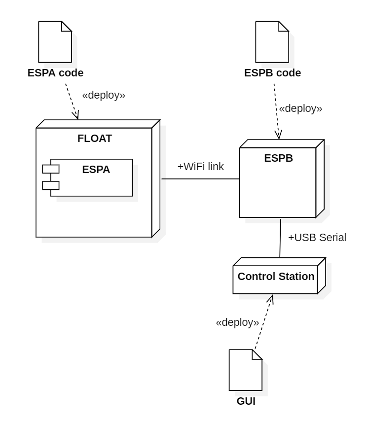
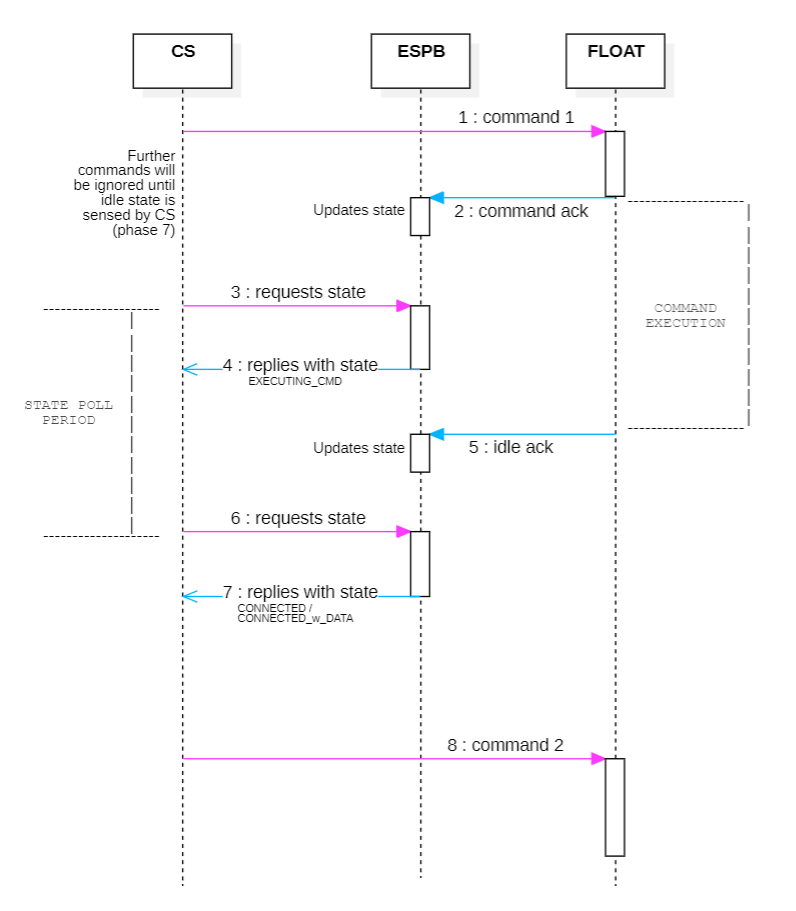
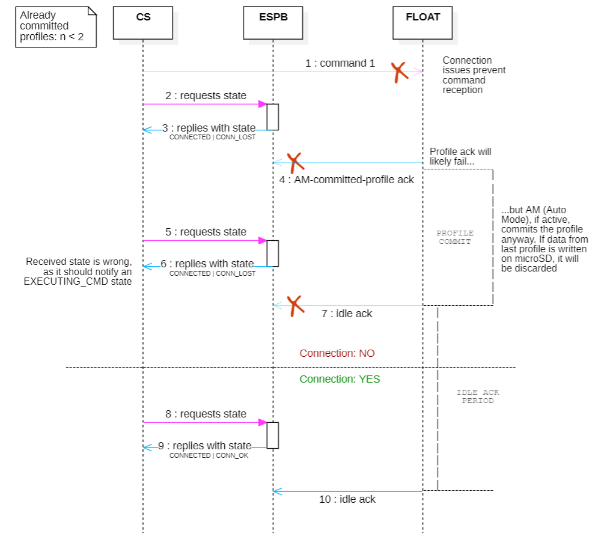

### INTRODUCTION AND CODE REQUIREMENTS 

By MATE requirements documentation (2023/2024), it is requested to send a test package to the CS (to be printed by the GUI), as soon as the FLOAT is in water. 

After it sends the package, the FLOAT can then start the first profile. During fall and rise, it measures pressure with a certain period (can be specified in milliseconds) and evaluates the depth from it with a 1/2 cm accuracy, writing it in a microSD every 5 seconds, together with the milliseconds elapsed from profile start and the team code, all encapsulated in a JSON format. The data file on the microSD is cleaned at every startup. To detect when to rise (when at the bottom) or send collected  data to Control Station (once at the water level), so to detect when it is stationary, the FLOAT compares the last two measurements and if they are equal in a given range, then the FLOAT can be considered still.  

After the profile, when it is at water level, the FLOAT has to read data written on microSD and send it to the CS, one package per data line. 

The GUI running on the CS will then plot depth and pressure measured during last profile. It is necessary a second profile after that and the plot of the relative data to gain maximum points. 

The FLOAT has to send only data relative to the last completed profile to get the points for the plot. 

It is possible to activate the Auto Mode (hereinafter referred to as AM) that in case of connection loss with the CS, make the FLOAT to commit a profile autonomously, given that the already completed profiles are less then two. This way, in case of long lasting connection loss, the AM will make the FLOAT commit the number of profiles necessary to the competition, and not more.

__________________________________________________________________________

### GENERAL DESIGN 

##### BEHAVIOR 

The general idea is that the FLOAT provides some micro-services that the CS can activate by sending commands to it. Every command can be requested at any moment, with the only limit that a command can be accepted by the FLOAT only when the previous one has been completed (more info on command cycle later). 

The FLOAT has two main logical states: the command execution one, and the idle one in which it waits for the new command. In idle state, the FLOAT can have some data from last completed profile that can be sent to the CS. 

##### SOFTWARE AND HARDWARE DEPLOYMENT  

FLOAT code has to be deployed on two ESP32, one mounted on the FLOAT board (ESPA) together with the sensors and the power supply, and the other (ESPB) 

communicating with the Control Station via USB. The two ESP32 communicates via WiFi. The software on the two ESP32 is designed to work of regardless of the design of the GUI on the CS. 

The idea is to bring all the complexity on the ESPA and GUI, leaving no trace of logic on the ESPB.

Deploy diagram:

##### COMMAND LIFE-CYCLE 

A command life-cycle does not overlaps/interfere with the previous nor the next one: when the CS sends a command (and it arrives to the FLOAT), a feedback from the FLOAT should inform about the acceptance of the command and if this acknowledgement arrives within a given period (specified later), next command requests will be ignored until end of execution of the current one, signaled by an idle acknowledgement. 
If the acknowledgement doesn't arrive within that time span, the command commit can be considered failed: this could happen for WiFi connection failures or FLOAT electronics issues. 

When waiting for the command commit acknowledgement, other command requests will be ignored as well.   

As already mentioned, after command completion the FLOAT will try to send an idle acknowledgement to signal that it is listening for a new command: together with the idle state, this acknowledgement can also inform about the presence of new data on the microSD that has to be sent to the CS. After an idle acknowledgement is received, a new command can be accepted.    

To maintain consistency with the status stored on the ESPB, and hence with the GUI visuals, the FLOAT grants to send the acknowledgement signalling a command commit only when the commit can be given for sure. 
In the same way, if the acknowledgement fails to be sent due to connection issues, the command is not committed. 

")

##### ESPB:  ROLE, BEHAVIOR AND USAGE 

The ESPB role is only to make the CS task of continuously checking on the WiFi channel less resource consuming. 

In particular, ESPB receives commands from CS via USB only to forward them to the FLOAT via WiFi. At the same time, it can receive feedback and data from the FLOAT. In the latter case the ESPB will forward the packages on the USB channel, while using them to update an internal state accordingly. The only code that should trigger the update of the state stored on ESPB is the firmware on the FLOAT, via the data and the feedback sent to CS (more later). This is because no assumptions have to be done by other software on the commands completion and acceptance. 

The ESPB state should mirror the FLOAT state at each moment (more details later) and can be used by the GUI to give visual feedback to the user or to drive its internal logic. It can be requested to the ESPB by the CS at any moment with a specific command. 
The state info sent to the CS with this command also contains WiFi connection state info and AM activation state info.  

In general, the ESPB feedback could be stale when requested (for example because the CS could poll it with a low frequency), so to get fresh, real-time data the CS should listen on the USB channel for the FLOAT packages, after a command request or when waiting for command completion and retrieve the FLOAT current state directly by those packages.  

Periodic polling remains a legit choice in case the CS cannot exploit interrupts triggered by Serial connection, but notice that this solution leads to delayed GUI visual feedback with respect to the changes on the FLOAT state.  

In some cases, connection losses can undermine consistency between the feedback of the ESPB (either they are polled or real time) and the real current FLOAT state (consistency threats for each FLOAT state later). 

##### GLOSSARY 

- **Commit a command**: To accept a sent command. After commit, command execution and success is ideally granted. 
- **Complete a command**: To execute all the requirements requested by a command. 

--------------------------------------------------------------------------

### IMPLEMENTATION PARAMETERS

##### FLOAT COMMANDS

Table of FLOAT commands with relative effects and acknowledgements:

|    Cmd string    | Cmd ESPA number | Cmd effects                                                                                                                                       |      ESPA ack string      |      ESPA ack effects on ESPB state       |
| :--------------: | :-------------: | ------------------------------------------------------------------------------------------------------------------------------------------------- | :-----------------------: | :---------------------------------------: |
|        GO        |        1        | Performs a profile in which measures depth and pressure and saves them to microSD                                                                 |         GO_RECVD          |    status to 2 (command execution)     |
|    LISTENING     |        2        | Requests data from last profile. If connection drops during sending, data is lost                                                                 |    Ack is data itself     |  status to 2 after first package arrival  |
|     BALANCE      |        3        | Moves the syriniges all the way down: usefull after pressure test, during which external pressure push syringes up                                |        CMD3_RECVD         |                status to 2                |
|     CLEAR_SD     |        4        | Clears data file on microSD                                                                                                                       |        CMD4_RECVD         |                status to 2                |
| SWITCH_AUTO_MODE |        5        | Toggles FLOAT Auto Mode                                                                                                                        |      SWITCH_AM_RECVD      | status to 2 , AM activation state toggled |
|   SEND_PACKAGE   |        6        | Requests a single test package to print on the GUI                                                                                             | Ack is the package itself |                status to 2                |
|    TRY_UPLOAD    |        7        | Requests to activate the Elegant OTA server on the ESPA for OTA firmware uploading. After the upload FLAOT restarts                               |     TRY_UPLOAD_RECVD      |              status to 2               |
|      STATUS      |        -        | Requests stale status to ESPB. It will respond with a status string containing FLOAT state, WiFi connection state and AM current activation state |             -             |                     -                     |

Once a command is completed, ESPA acknowledgement can be:

| ESPA ack string   | ESPA ack effects on ESPB state          | ESPA state                                  |
| ----------------- | --------------------------------------- | ------------------------------------------- |
| FLOAT_IDLE        | status to 0 (idle)                      | Idle with no data to be sent                |
| FLOAT_IDLE_W_DATA | status to 1 (idle with data to be sent) | Idle with data from last profile to be sent |

##### STATUS COMMAND: ESPB RESPONSE

ESPB response to **STATUS** command is composed by three parts of information: ESPA state (stale), activation of the AM on the FLOAT and WiFi connection state. The WiFi connection state is detected with the sending of a test package, while the other states are kept consistent with the ones on the FLOAT by updating them after acknowledgements reception.

- **ESPA state**:

| ESPB state string | ESPB state number | State description                                                                                                     |
| :---------------: | :---------------: | --------------------------------------------------------------------------------------------------------------------- |
|     CONNECTED     |         0         | The FLOAT is listening for new command. Previous command succeeded                                                    |
| CONNECTED_W_DATA  |         1         | The FLOAT is listening for new command and has some new data from last profile to be sent. Previous command succeeded |
|   EXECUTING_CMD   |         2         | FLOAT is executing a command                                                                                          |
|   STATUS_ERROR    |         -         | Internal error in reading the state number                                                                            |

> ==**WARNING:**== 
> If committing a profile automatically, the relative acknowledgement will likely fail due to connection loss. The profile is committed anyway as it is generated from connection loss in the first place, but the GUI may not have mean to detect it. So it will likely read an **inconsistent** **idle** **status** (CONNECTED or CONNECTED_W_DATA) until FLOAT is at water level with a stable WiFi connection. In the meantime the command commits will fail, for connection loss or because the FLOAT is underwater. Anyway WiFi connection state can be detected by the STATUS command, hence giving feedback on status consistency.
> 

- **AM state**:

| ESPB state string | State description                                                         |
| :---------------: | ------------------------------------------------------------------------- |
|   AUTO_MODE_YES   | AM on FLOAT is activated                                                  |
|   AUTO_MODE_NO    | AM on FLOAT is not activated: connection losses will not trigger profiles |

- **WiFi connection state**:

| ESPB state string | State description                                            |
| :---------------: | ------------------------------------------------------------ |
|      CONN_OK      | WiFi connection is ok                                        |
|     CONN_LOST     | WiFi connection is currently down. ESPB state could be wrong |

Example of ESPB state response: **CONNECTED_W_DATA | AUTO_MODE_NO | CONN_OK**

--------------------------------------------------------------------------

### UTILITIES AND RESOURCES

Links to Arduino library repositories:
- ESPAsyncWebServer: https://github.com/dvarrel/ESPAsyncWebSrv 
- AsyncElegantOTA: https://github.com/ayushsharma82/AsyncElegantOTA
