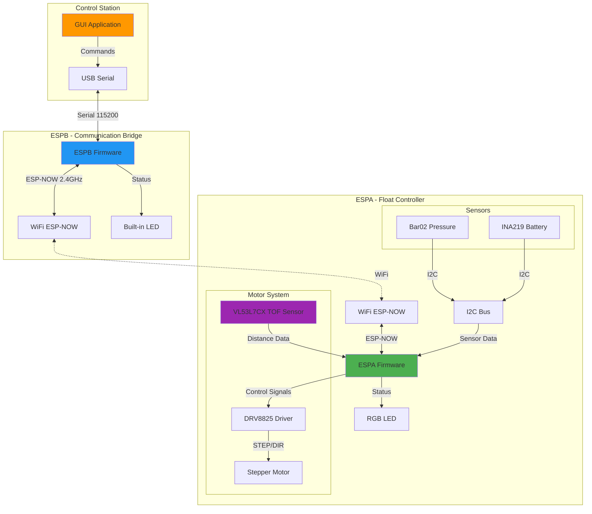
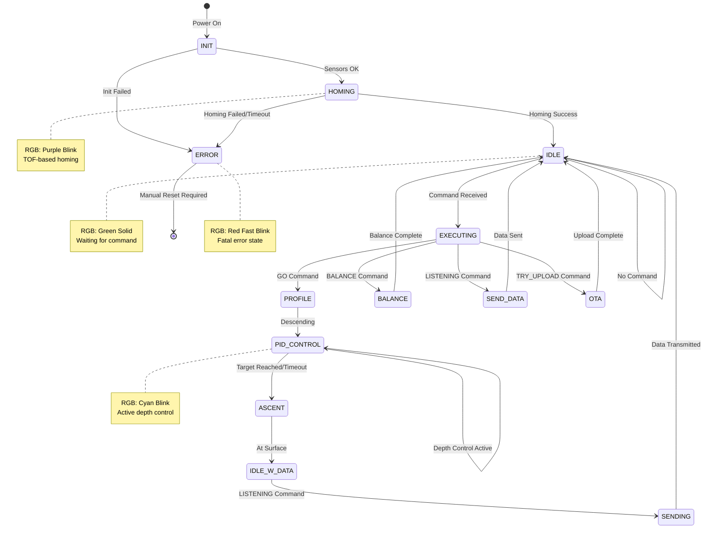
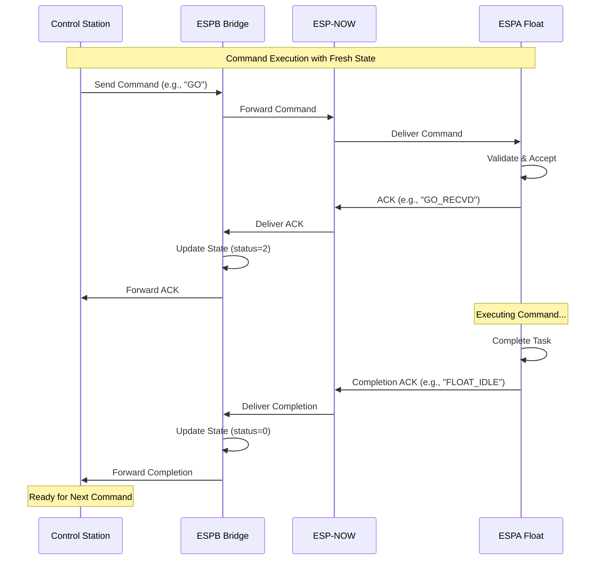
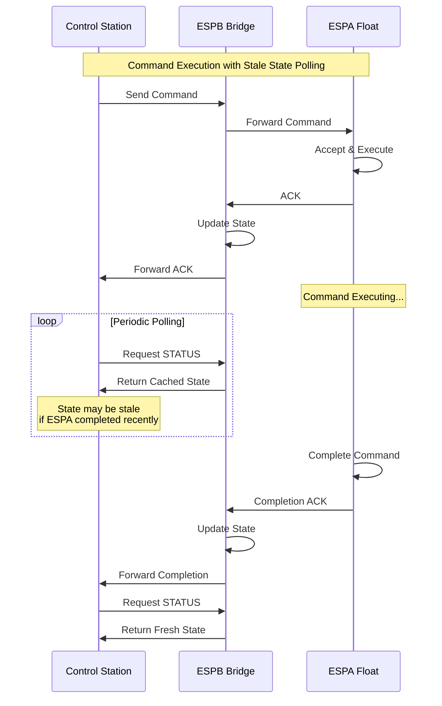
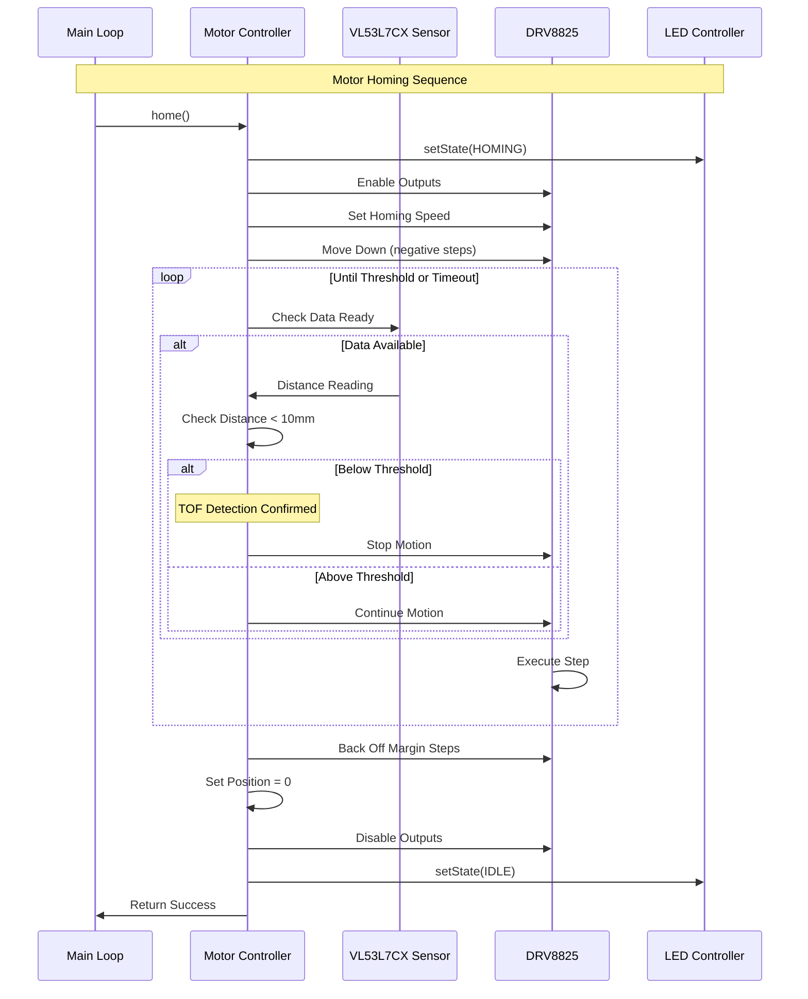

# PoliTOcean Float 2025 - Technical Documentation

**Version:** 11.0.0  
**Team:** PoliTOcean @ Politecnico di Torino  
**Competition:** MATE ROV 2025/26

--------------------------------------------------------------------------

## 📋 TABLE OF CONTENTS

1. [Project Overview](#-project-overview)
   - [Introduction & Requirements](#introduction-and-requirements)
   - [System Behavior](#system-behavior)
2. [Hardware Configuration](#-hardware-configuration)
   - [Pin Mapping](#pin-mapping)
   - [I2C Devices](#i2c-device-addresses)
3. [System Architecture](#-system-architecture)
   - [Deployment Diagram](#deployment-diagram)
   - [Software Structure](#software-structure)
   - [ESPA State Machine](#espa-state-machine)
4. [Communication Protocol](#-communication-protocol)
   - [Command Lifecycle](#command-lifecycle)
   - [ESPB Bridge Role](#espb-bridge-role)
   - [Command Reference](#float-commands)
   - [Status Responses](#status-command-espb-response)
5. [LED Status Indicators](#-led-status-indicators)
6. [Project Updates](#-project-updates)
   - [Hardware Changes](#hardware-changes)
   - [TOF Homing System](#tof-homing-system)
   - [Technical Details](#technical-details)
7. [Utilities & Resources](#-utilities-and-resources)
8. [Glossary](#-glossary)

--------------------------------------------------------------------------

## 🎯 PROJECT OVERVIEW

### Introduction and Requirements

By MATE 2026 requirements documentation (Task 4.1 - MATE Floats Under the Ice), the FLOAT must complete operational vertical profiling missions under simulated ice conditions.

**Pre-Deployment Requirements:**
- The FLOAT must communicate with the Mission Station (CS) prior to descending, transmitting a **defined data packet** containing:
  - Company number (provided by MATE)
  - Time data (UTC/local/float time)
  - Pressure data (pa or kpa) and/or depth data (m or cm)
  - Additional data as required
- Example packet: `EX01 1:51:42 UTC 9.8 kpa 1.00 meters`

**Vertical Profile Requirements:**

The FLOAT must complete **two vertical profiles** using a buoyancy engine (fluid displacement system, not thrusters). Each profile consists of:

1. **Descent Phase**: Descend from surface to **2.5 meters depth** (± 33 cm)
2. **Deep Hold**: Maintain depth at **2.5 meters** for **30 seconds** (bottom of float as reference)
3. **Ascent Phase**: Rise to **40 cm depth** (± 33 cm) without breaking surface or contacting ice
4. **Shallow Hold**: Maintain depth at **40 cm** for **30 seconds** (top of float as reference)

**Data Collection & Transmission:**

- Collect depth/pressure measurements every **5 seconds** during both profiles (minimum 20 data packets)
- Store data on microSD with JSON format containing: timestamp, depth, pressure, team code
- After recovery, transmit all collected data wirelessly to the Mission Station
- Data packets must show **7 sequential measurements** (spanning 30 seconds at 5-second intervals: 0, 5, 10, 15, 20, 25, 30) confirming proper depth maintenance at both 2.5m and 0.4m

**Post-Mission Requirements:**

- Upon surface recovery, autonomously transmit all profile data to the CS
- CS GUI plots depth over time using received data (minimum 20 data packets required)
- Graph must display time (X-axis) vs depth (Y-axis) for both completed profiles

**Auto Mode (AM):**

An autonomous operating mode that triggers profile execution in case of connection loss with the CS, ensuring mission completion if communication is temporarily unavailable. AM will autonomously commit up to two profiles when connection is lost, preventing incomplete missions due to transient WiFi failures.

**Penalties:**
- Breaking surface or contacting ice sheet during profile: **-5 points per profile**
- FLOAT must remain submerged between 40 cm and 2.5 m throughout the ascent/descent phases

### System Behavior

The general idea is that the FLOAT provides some micro-services that the CS can activate by sending commands to it. Every command can be requested at any moment, with the only limit that a command can be accepted by the FLOAT only when the previous one has been completed (more info on command cycle later). 

The FLOAT has two main logical states: the command execution one, and the idle one in which it waits for the new command. In idle state, the FLOAT can have some data from last completed profile that can be sent to the CS.

--------------------------------------------------------------------------

## 🔧 HARDWARE CONFIGURATION

### Pin Mapping

#### ESPA (Float Controller) Pin Mapping:

| Function | GPIO Pin | Connected To | Notes |
|:---------|:--------:|:------------|:------|
| **Motor Control** ||||
| DIR | GPIO32 | DRV8825 Direction | Stepper direction control |
| STEP | GPIO33 | DRV8825 Step | Step pulse generation |
| EN | GPIO27 | DRV8825 Enable | Active-LOW, disables outputs when HIGH |
| SLEEP | GPIO25 | DRV8825 Sleep | Active-LOW, must be HIGH for operation |
| RST | GPIO26 | DRV8825 Reset | Active-LOW, must be HIGH for operation |
| **TOF Sensor** ||||
| SDA | GPIO21 | VL53L7CX I2C Data | I2C bus (shared with sensors) |
| SCL | GPIO22 | VL53L7CX I2C Clock | I2C bus @ 1MHz |
| LPN | GPIO16 | VL53L7CX Power | Low Power Enable |
| I2C_RST | GPIO15 | VL53L7CX Reset | Hardware reset control |
| **Sensors** ||||
| SDA | GPIO21 | Bar02, INA219 | I2C bus (shared) |
| SCL | GPIO22 | Bar02, INA219 | I2C bus (shared) |
| **Status LED** ||||
| LED_R | GPIO19 | Red Channel | PWM control |
| LED_G | GPIO18 | Green Channel | PWM control |
| LED_B | GPIO5 | Blue Channel | PWM control |

#### ESPB (Communication Bridge) Pin Mapping:

| Function | GPIO Pin | Connected To | Notes |
|:---------|:--------:|:------------|:------|
| **Communication** ||||
| TX | GPIO1 | USB Serial | 115200 baud |
| RX | GPIO3 | USB Serial | 115200 baud |
| **Status LED** ||||
| Built-in LED | GPIO2 | Onboard LED | Status indication |

### I2C Device Addresses:

| Device | Address | Bus Speed |
|:-------|:-------:|:---------|
| VL53L7CX TOF | 0x29 | 1 MHz |
| Bar02 Pressure | 0x76 | 100 kHz |
| INA219 Battery | 0x40 | 100 kHz |

--------------------------------------------------------------------------

## 🏗️ SYSTEM ARCHITECTURE

### Deployment Diagram

FLOAT code has to be deployed on two ESP32, one mounted on the FLOAT board (ESPA) together with the sensors and the power supply, and the other (ESPB) communicating with the Control Station via USB. The two ESP32 communicates via WiFi using ESP-NOW protocol. The software on the two ESP32 is designed to work regardless of the design of the GUI on the CS. 

The idea is to bring all the complexity on the ESPA and GUI, leaving no trace of logic on the ESPB.


```mermaid
graph TB
    subgraph "Control Station"
        GUI[GUI Application]
        USB[USB Serial]
    end
    
    subgraph "ESPB - Communication Bridge"
        ESPB_FW[ESPB Firmware]
        ESPB_WiFi[WiFi ESP-NOW]
        ESPB_LED[Built-in LED]
    end
    
    subgraph "ESPA - Float Controller"
        ESPA_FW[ESPA Firmware]
        ESPA_WiFi[WiFi ESP-NOW]
        
        subgraph "Motor System"
            DRV8825[DRV8825 Driver]
            STEPPER[Stepper Motor]
            TOF[VL53L7CX TOF Sensor]
        end
        
        subgraph "Sensors"
            BAR02[Bar02 Pressure]
            INA219[INA219 Battery]
        end
        
        RGB[RGB LED]
        I2C[I2C Bus]
    end
    
    GUI -->|Commands| USB
    USB <-->|Serial 115200| ESPB_FW
    ESPB_FW <-->|ESP-NOW 2.4GHz| ESPB_WiFi
    ESPB_WiFi <-.->|WiFi| ESPA_WiFi
    ESPA_WiFi <-->|ESP-NOW| ESPA_FW
    
    ESPA_FW -->|Control Signals| DRV8825
    DRV8825 -->|STEP/DIR| STEPPER
    TOF -->|Distance Data| ESPA_FW
    
    BAR02 -->|I2C| I2C
    INA219 -->|I2C| I2C
    I2C -->|Sensor Data| ESPA_FW
    
    ESPA_FW -->|Status| RGB
    ESPB_FW -->|Status| ESPB_LED
    
    style ESPA_FW fill:#4CAF50
    style ESPB_FW fill:#2196F3
    style GUI fill:#FF9800
    style TOF fill:#9C27B0
```

### Software Structure

The project follows a modular architecture with separate compilation units:
- **Motor Control** (motor.cpp/h) - Stepper motor control and TOF homing
- **Communication** (comms.cpp/h) - ESP-NOW wireless protocol  
- **Sensors** (sensors.cpp/h) - Bar02, INA219 sensor management
- **PID Controller** (pid.cpp/h) - Depth control algorithm
- **Profile Manager** (profile.cpp/h) - Mission profile execution
- **LED Controller** (led.cpp/h) - Status indication system

### ESPA State Machine

The ESPA firmware operates as a state machine coordinating motor control, sensors, and communications:


```mermaid
stateDiagram-v2
    [*] --> INIT: Power On
    
    INIT --> HOMING: Sensors OK
    INIT --> ERROR: Init Failed
    
    HOMING --> IDLE: Homing Success
    HOMING --> ERROR: Homing Failed/Timeout
    
    IDLE --> EXECUTING: Command Received
    IDLE --> IDLE: No Command
    
    EXECUTING --> PROFILE: GO Command
    EXECUTING --> BALANCE: BALANCE Command
    EXECUTING --> SEND_DATA: LISTENING Command
    EXECUTING --> OTA: TRY_UPLOAD Command
    
    PROFILE --> PID_CONTROL: Descending
    PID_CONTROL --> PID_CONTROL: Depth Control Active
    PID_CONTROL --> ASCENT: Target Reached/Timeout
    ASCENT --> IDLE_W_DATA: At Surface
    
    BALANCE --> IDLE: Balance Complete
    SEND_DATA --> IDLE: Data Sent
    OTA --> IDLE: Upload Complete
    
    IDLE_W_DATA --> SENDING: LISTENING Command
    SENDING --> IDLE: Data Transmitted
    
    ERROR --> [*]: Manual Reset Required
    
    note right of IDLE
        RGB: Green Solid
        Waiting for command
    end note
    
    note right of HOMING
        RGB: Purple Blink
        TOF-based homing
    end note
    
    note right of PID_CONTROL
        RGB: Cyan Blink
        Active depth control
    end note
    
    note right of ERROR
        RGB: Red Fast Blink
        Fatal error state
    end note
```

--------------------------------------------------------------------------

## 📡 COMMUNICATION PROTOCOL

### Command Lifecycle

A command life-cycle does not overlaps/interfere with the previous nor the next one: when the CS sends a command (and it arrives to the FLOAT), a feedback from the FLOAT should inform about the acceptance of the command and if this acknowledgement arrives within a given period (specified later), next command requests will be ignored until end of execution of the current one, signaled by an idle acknowledgement. 

If the acknowledgement doesn't arrive within that time span, the command commit can be considered failed: this could happen for WiFi connection failures or FLOAT electronics issues. 

When waiting for the command commit acknowledgement, other command requests will be ignored as well.   

As already mentioned, after command completion the FLOAT will try to send an idle acknowledgement to signal that it is listening for a new command: together with the idle state, this acknowledgement can also inform about the presence of new data on the microSD that has to be sent to the CS. After an idle acknowledgement is received, a new command can be accepted.    

To maintain consistency with the status stored on the ESPB, and hence with the GUI visuals, the FLOAT grants to send the acknowledgement signalling a command commit only when the commit can be given for sure. In the same way, if the acknowledgement fails to be sent due to connection issues, the command is not committed.


```mermaid
sequenceDiagram
    participant CS as Control Station
    participant ESPB as ESPB Bridge
    participant WiFi as ESP-NOW
    participant ESPA as ESPA Float
    
    Note over CS,ESPA: Command Execution with Fresh State
    
    CS->>ESPB: Send Command (e.g., "GO")
    ESPB->>WiFi: Forward Command
    WiFi->>ESPA: Deliver Command
    
    ESPA->>ESPA: Validate & Accept
    ESPA->>WiFi: ACK (e.g., "GO_RECVD")
    WiFi->>ESPB: Deliver ACK
    ESPB->>ESPB: Update State (status=2)
    ESPB->>CS: Forward ACK
    
    Note over ESPA: Executing Command...
    
    ESPA->>ESPA: Complete Task
    ESPA->>WiFi: Completion ACK (e.g., "FLOAT_IDLE")
    WiFi->>ESPB: Deliver Completion
    ESPB->>ESPB: Update State (status=0)
    ESPB->>CS: Forward Completion
    
    Note over CS: Ready for Next Command
```

### ESPB Bridge Role

The ESPB role is only to make the CS task of continuously checking on the WiFi channel less resource consuming. 

In particular, ESPB receives commands from CS via USB only to forward them to the FLOAT via WiFi. At the same time, it can receive feedback and data from the FLOAT. In the latter case the ESPB will forward the packages on the USB channel, while using them to update an internal state accordingly. The only code that should trigger the update of the state stored on ESPB is the firmware on the FLOAT, via the data and the feedback sent to CS (more later). This is because no assumptions have to be done by other software on the commands completion and acceptance. 

The ESPB state should mirror the FLOAT state at each moment (more details later) and can be used by the GUI to give visual feedback to the user or to drive its internal logic. It can be requested to the ESPB by the CS at any moment with a specific command. The state info sent to the CS with this command also contains WiFi connection state info and AM activation state info.  

In general, the ESPB feedback could be stale when requested (for example because the CS could poll it with a low frequency), so to get fresh, real-time data the CS should listen on the USB channel for the FLOAT packages, after a command request or when waiting for command completion and retrieve the FLOAT current state directly by those packages.  

Periodic polling remains a legit choice in case the CS cannot exploit interrupts triggered by Serial connection, but notice that this solution leads to delayed GUI visual feedback with respect to the changes on the FLOAT state.  

In some cases, connection losses can undermine consistency between the feedback of the ESPB (either they are polled or real time) and the real current FLOAT state (consistency threats for each FLOAT state later).


```mermaid
sequenceDiagram
    participant CS as Control Station
    participant ESPB as ESPB Bridge
    participant ESPA as ESPA Float
    
    Note over CS,ESPA: Command Execution with Stale State Polling
    
    CS->>ESPB: Send Command
    ESPB->>ESPA: Forward Command
    ESPA->>ESPA: Accept & Execute
    ESPA->>ESPB: ACK
    ESPB->>ESPB: Update State
    ESPB->>CS: Forward ACK
    
    Note over ESPA: Command Executing...
    
    loop Periodic Polling
        CS->>ESPB: Request STATUS
        ESPB->>CS: Return Cached State
        Note over CS: State may be stale<br/>if ESPA completed recently
    end
    
    ESPA->>ESPA: Complete Command
    ESPA->>ESPB: Completion ACK
    ESPB->>ESPB: Update State
    ESPB->>CS: Forward Completion
    
    CS->>ESPB: Request STATUS
    ESPB->>CS: Return Fresh State
```

### FLOAT Commands

Table of FLOAT commands with relative effects and acknowledgements:

|    Cmd string    | Cmd ESPA number | Cmd effects                                                                                                                                       |      ESPA ack string      |      ESPA ack effects on ESPB state       |
| :--------------: | :-------------: | ------------------------------------------------------------------------------------------------------------------------------------------------- | :-----------------------: | :---------------------------------------: |
|        GO        |        1        | Performs a profile in which measures depth and pressure and saves them to microSD                                                                 |         GO_RECVD          |    status to 2 (command execution)<br>    |
|    LISTENING     |        2        | Requests data from last profile. If connection drops during sending, data is lost                                                                 |    Ack is data itself     |  status to 2 after first package arrival  |
|     BALANCE      |        3        | Moves the syringes all the way down: useful after pressure test, during which external pressure push syringes up                                |        CMD3_RECVD         |                status to 2                |
|     CLEAR_SD     |        4        | Clears data file on microSD                                                                                                                       |        CMD4_RECVD         |                status to 2                |
| SWITCH_AUTO_MODE |        5        | Toggles FLOAT Auto Mode <br>                                                                                                                      |      SWITCH_AM_RECVD      | status to 2 , AM activation state toggled |
|   SEND_PACKAGE   |        6        | Requests a single test package to print on the GUI<br>                                                                                            | Ack is the package itself |                status to 2                |
|    TRY_UPLOAD    |        7        | Requests to activate the Elegant OTA server on the ESPA for OTA firmware uploading. After the upload FLOAT restarts                               |     TRY_UPLOAD_RECVD      |              status to 2<br>              |
|      STATUS      |        -        | Requests stale status to ESPB. It will respond with a status string containing FLOAT state, WiFi connection state and AM current activation state |             -             |                     -                     |

Once a command is completed, ESPA acknowledgement can be:

| ESPA ack string   | ESPA ack effects on ESPB state          | ESPA state                                  |
| ----------------- | --------------------------------------- | ------------------------------------------- |
| FLOAT_IDLE        | status to 0 (idle)                      | Idle with no data to be sent                |
| FLOAT_IDLE_W_DATA | status to 1 (idle with data to be sent) | Idle with data from last profile to be sent |

### STATUS COMMAND: ESPB RESPONSE

ESPB response to **STATUS** command is composed by three parts of information: ESPA state (stale), activation of the AM on the FLOAT and WiFi connection state. The WiFi connection state is detected with the sending of a test package, while the other states are kept consistent with the ones on the FLOAT by updating them after acknowledgements reception.

**ESPA state:**

| ESPB state string | ESPB state number | State description                                                                                                     |
| :---------------: | :---------------: | --------------------------------------------------------------------------------------------------------------------- |
|     CONNECTED     |         0         | The FLOAT is listening for new command. Previous command succeeded                                                    |
| CONNECTED_W_DATA  |         1         | The FLOAT is listening for new command and has some new data from last profile to be sent. Previous command succeeded |
|   EXECUTING_CMD   |         2         | FLOAT is executing a command                                                                                          |
|   STATUS_ERROR    |         -         | Internal error in reading the state number                                                                            |

> **WARNING:**  
> If committing a profile automatically, the relative acknowledgement will likely fail due to connection loss. The profile is committed anyway as it is generated from connection loss in the first place, but the GUI may not have mean to detect it. So it will likely read an **inconsistent idle status** (CONNECTED or CONNECTED_W_DATA) until FLOAT is at water level with a stable WiFi connection. In the meantime the command commits will fail, for connection loss or because the FLOAT is underwater. Anyway WiFi connection state can be detected by the STATUS command, hence giving feedback on status consistency.
> 
> ```mermaid
> sequenceDiagram
>     participant CS as Control Station
>     participant ESPB as ESPB Bridge
>     participant ESPA as ESPA Float
>     
>     Note over ESPA: Auto Mode Active
>     Note over ESPA,ESPB: Connection Lost!
>     
>     ESPA->>ESPA: Detect Connection Loss
>     ESPA->>ESPA: Auto-commit Profile
>     
>     Note over ESPA: Descending...<br/>WiFi Unavailable
>     
>     ESPA-xESPB: ACK Fails (No Connection)
>     
>     Note over ESPB: State Becomes Inconsistent<br/>Still shows "IDLE"
>     
>     CS->>ESPB: Request STATUS
>     ESPB->>CS: CONNECTED | CONN_LOST
>     Note over CS: GUI shows inconsistent state<br/>but WiFi loss detected
>     
>     Note over ESPA: At Surface...<br/>WiFi Restored
>     
>     ESPA->>ESPB: FLOAT_IDLE_W_DATA
>     ESPB->>ESPB: Update to Consistent State
>     ESPB->>CS: Forward State
>     
>     Note over CS,ESPA: Consistency Restored
> ```

**AM state:**

| ESPB state string | State description                                                         |
| :---------------: | ------------------------------------------------------------------------- |
|   AUTO_MODE_YES   | AM on FLOAT is activated                                                  |
|   AUTO_MODE_NO    | AM on FLOAT is not activated: connection losses will not trigger profiles |

**WiFi connection state:**

| ESPB state string | State description                                            |
| :---------------: | ------------------------------------------------------------ |
|      CONN_OK      | WiFi connection is ok                                        |
|     CONN_LOST     | WiFi connection is currently down. ESPB state could be wrong |

**Example of ESPB state response:** `CONNECTED_W_DATA | AUTO_MODE_NO | CONN_OK`

--------------------------------------------------------------------------

## 💡 LED STATUS INDICATORS

The FLOAT is equipped with RGB LEDs on both ESP32 boards that provide visual feedback about the system status:

### ESPA (Float Board) LED States:

| LED Color/Pattern | State | Description |
|:----------------:|:-----:|:------------|
| **Green 2 Blink** | `LED_INIT` | System initializing |
| **Green Solid** | `LED_IDLE` | Ready and idle, waiting for commands |
| **Green Fast Blink** | `LED_IDLE_DATA` | Idle with data ready to send |
| **Red Solid** | `LED_LOW_BATTERY` | Battery voltage below threshold (11.5V) |
| **Red Fast Blink** | `LED_ERROR` | Error state or endstop hit |
| **Blue Solid** | `LED_PROFILE` | Running depth profile |
| **Yellow Blink** | `LED_AUTO_MODE` | Auto mode active |
| **Purple Blink** | `LED_HOMING` | Motor homing in progress |
| **Cyan Blink** | `LED_PID_CONTROL` | PID depth control active |
| **White Blink** | `LED_COMMUNICATION` | Communicating with ESPB |
| **Orange Blink** | `LED_OTA_MODE` | OTA update mode active |
| **Off** | `LED_OFF` | System off or disabled |

### ESPB (Communication Bridge) LED States:

| LED Pattern | State | Description |
|:----------------:|:-----:|:------------|
| **Solid On** | `LED_IDLE` | Connected and ready |
| **Very Fast Blink** | `LED_ERROR` | Communication error |
| **Off** | `LED_OFF` | System off or disabled |

> **Note**: ESPB uses the built-in LED (pin 2) with different blink patterns to indicate status, as it does not have external RGB connections.

--------------------------------------------------------------------------

## 📝 PROJECT UPDATES

### Version 11.0.0 - TOF Integration & Hardware Reconfiguration

#### Hardware Changes:
- **TOF Sensor Integration**: Replaced mechanical endstops with VL53L7CX Time-of-Flight sensor for non-contact homing
- **Pin Reconfiguration**: Updated DRV8825 driver pin assignments for new PCB layout:
  - PIN_DIR: GPIO32 (was GPIO25)
  - PIN_STEP: GPIO33 (was GPIO26)
  - PIN_SLEEP: GPIO25 (was GPIO32)
  - PIN_RST: GPIO26 (was GPIO35) - Now properly initialized
- **TOF Sensor Pins**: 
  - LPN Pin: GPIO16 (Low Power Enable)
  - I2C_RST Pin: GPIO15 (Hardware Reset)

#### TOF Homing System:
- **VL53L7CX Configuration**: 4x4 resolution with 30 Hz ranging frequency for rapid detection
- **Non-Contact Detection**: Detects piston proximity via distance measurement (threshold: 10mm)
- **Improved Reliability**: No mechanical wear, consistent detection regardless of mounting tolerances
- **Factory Reset Sequence**: Proper sensor initialization with hardware reset on startup

**Design Rationale:**

The transition from mechanical endstops to Time-of-Flight sensing addresses several reliability concerns:

**Mechanical Endstops (Previous Design):**
- ❌ Subject to mechanical wear and contact bounce
- ❌ Require precise mounting and alignment
- ❌ Can fail due to water ingress or corrosion
- ❌ Introduce mechanical stress on moving parts
- ❌ Limited to binary (contact/no-contact) detection

**TOF Sensor (Current Design):**
- ✅ Non-contact, no mechanical wear
- ✅ Provides continuous distance measurement
- ✅ Immune to alignment tolerances
- ✅ No electrical noise from contact bounce
- ✅ Potential for position feedback during operation
- ✅ Waterproof optical measurement

The VL53L7CX was selected for its:
- Multi-zone ranging capability (4x4 array)
- Fast ranging frequency (up to 60 Hz)
- High accuracy (±3mm) at short distances
- I2C interface compatible with existing sensor bus
- Low power consumption options


```mermaid
sequenceDiagram
    participant Main as Main Loop
    participant Motor as Motor Controller
    participant TOF as VL53L7CX Sensor
    participant Driver as DRV8825
    participant LED as LED Controller
    
    Note over Main,LED: Motor Homing Sequence
    
    Main->>Motor: home()
    Motor->>LED: setState(HOMING)
    Motor->>Driver: Enable Outputs
    Motor->>Driver: Set Homing Speed
    Motor->>Driver: Move Down (negative steps)
    
    loop Until Threshold or Timeout
        Motor->>TOF: Check Data Ready
        alt Data Available
            TOF->>Motor: Distance Reading
            Motor->>Motor: Check Distance < 10mm
            alt Below Threshold
                Note over Motor: TOF Detection Confirmed
                Motor->>Driver: Stop Motion
            else Above Threshold
                Motor->>Driver: Continue Motion
            end
        end
        Driver->>Driver: Execute Step
    end
    
    Motor->>Driver: Back Off Margin Steps
    Motor->>Motor: Set Position = 0
    Motor->>Driver: Disable Outputs
    Motor->>LED: setState(IDLE)
    Motor->>Main: Return Success
```

#### Major Improvements:
- **Migration to PlatformIO**: Project restructured for modern development with dual environment support
- **Modular Architecture**: Split monolithic main.cpp into separate .h/.cpp modules:
  - Motor Control (motor.cpp/h)
  - Communication (comms.cpp/h)
  - Sensors (sensors.cpp/h)
  - PID Controller (pid.cpp/h)
  - Profile Manager (profile.cpp/h)
  - LED Controller (led.cpp/h)
- **AccelStepper Integration**: Enhanced motor control with acceleration, precise positioning, and non-blocking operation
- **TOF-Based Homing**: Replaced mechanical endstops with optical distance sensing
- **Motor Homing**: Comprehensive homing sequence with timeout protection and safety margins
- **Enhanced PID Control**: Tuned parameters for underwater operation with anti-windup protection
- **RGB LED Status**: Comprehensive visual feedback system with 13 different states
- **ElegantOTA Migration**: Updated from deprecated AsyncElegantOTA to modern ElegantOTA
- **Improved Safety**: Multiple safety layers including TOF-based protection and motor limits

#### Technical Details:

**DRV8825 Initialization Sequence:**
```cpp
// Critical initialization order for reliable operation:
1. Configure GPIO pins (DIR, STEP, EN, SLEEP, RST)
2. Set SLEEP = HIGH (driver awake)
3. Set RST = HIGH (reset not asserted, active-low)
4. Configure AccelStepper with setPinsInverted() first
5. Then call setEnablePin() to avoid glitches
```

**TOF Sensor Configuration:**
- **Resolution**: 4x4 pixel array (16 zones)
- **Ranging Frequency**: 30 Hz for responsive homing
- **Detection Pixel**: Center pixel (index 5) used for homing
- **I2C Speed**: 1 MHz (Fast Mode Plus)
- **Firmware Load Time**: 5-10 seconds on initialization

**Motor Configuration:**
- **Max Speed**: 200 steps/sec (normal operation)
- **Homing Speed**: 300 steps/sec
- **Max Travel**: 1730 steps
- **Safety Margin**: 10 steps from endpoints
- **Homing Timeout**: 10 seconds

--------------------------------------------------------------------------

## 📚 UTILITIES AND RESOURCES

**Arduino Library Repositories:**
- ESPAsyncWebServer: https://github.com/dvarrel/ESPAsyncWebSrv 
- AsyncElegantOTA: https://github.com/ayushsharma82/AsyncElegantOTA

**Development Tools:**
- PlatformIO IDE: Modern embedded development platform
- ESP32 Arduino Core: Framework for ESP32 development
- AccelStepper Library: Non-blocking stepper motor control
- VL53L7CX Library: Time-of-Flight sensor driver

--------------------------------------------------------------------------

## 📖 GLOSSARY

- **AM (Auto Mode)**: Autonomous operation mode that triggers profiles on connection loss
- **CS (Control Station)**: Ground-based computer running the GUI application
- **ESPA**: ESP32 mounted on the Float board (primary controller)
- **ESPB**: ESP32 communication bridge between Float and CS
- **Commit a command**: To accept a sent command. After commit, command execution and success is ideally granted
- **Complete a command**: To execute all the requirements requested by a command
- **Profile**: A complete mission cycle (descent → depth control → ascent → data transmission)
- **TOF (Time-of-Flight)**: Non-contact distance measurement technology using light pulses
- **Homing**: Process of establishing the motor's zero reference position
- **PID Control**: Proportional-Integral-Derivative controller for precise depth maintenance
- **ESP-NOW**: Low-latency peer-to-peer WiFi communication protocol by Espressif

--------------------------------------------------------------------------

**Documentation Version:** 11.0.0  
**Last Updated:** March 2026  
**Team Contact:** PoliTOcean @ Politecnico di Torino

