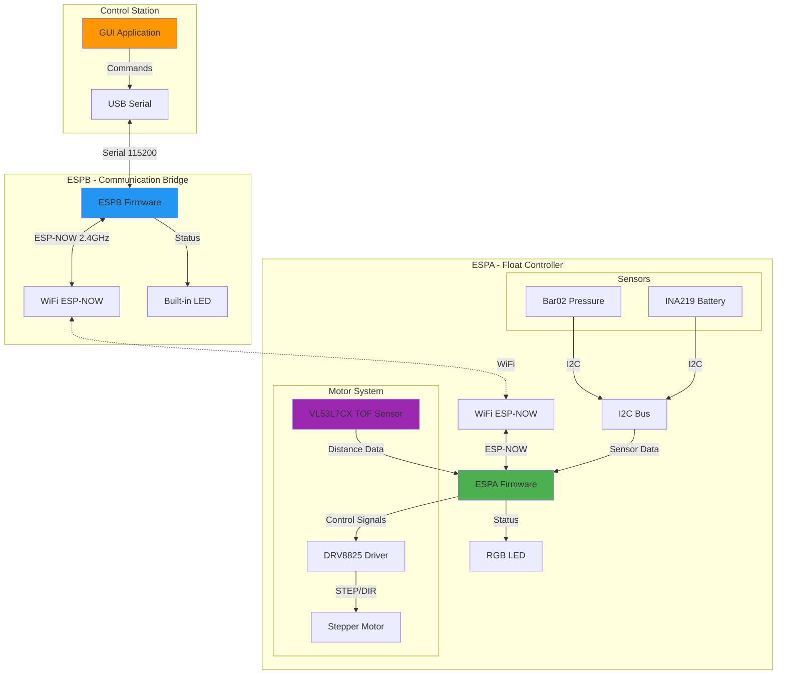
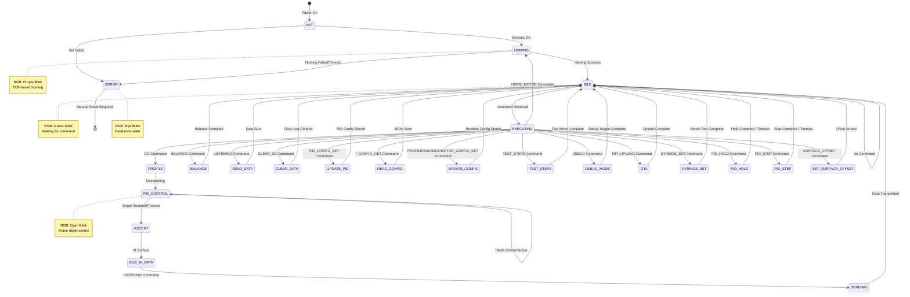
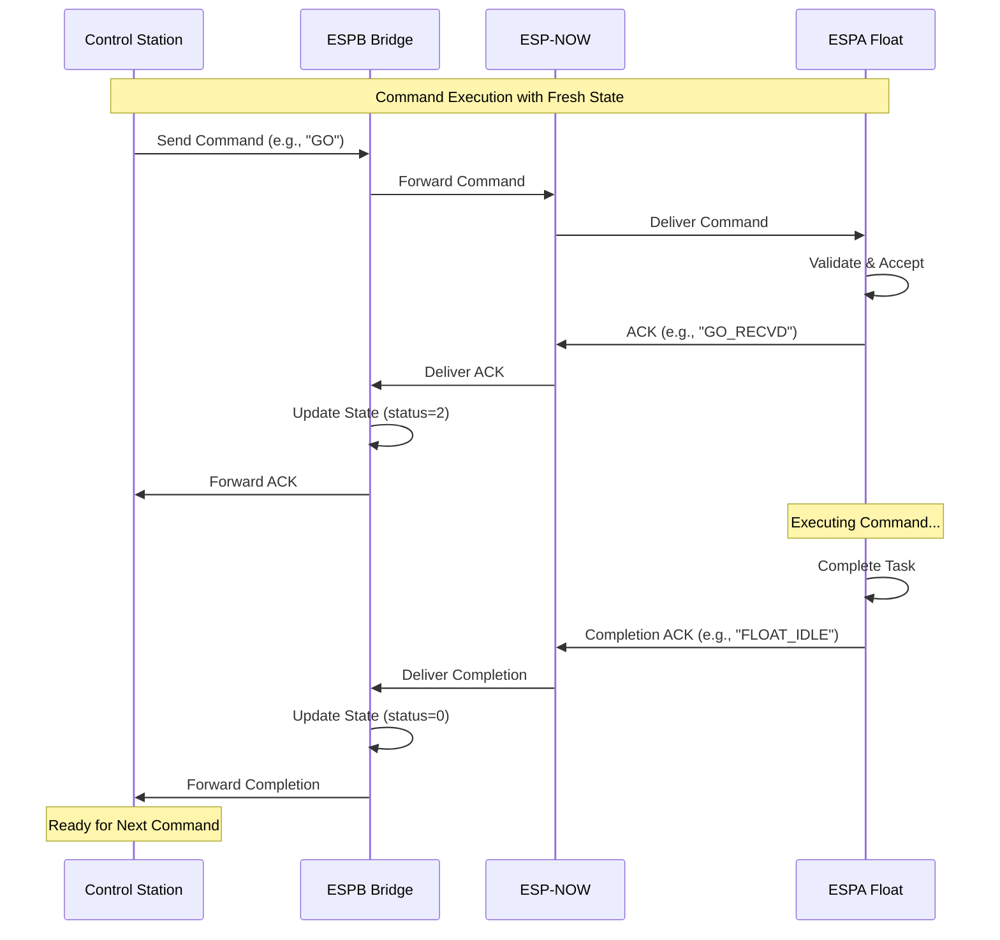
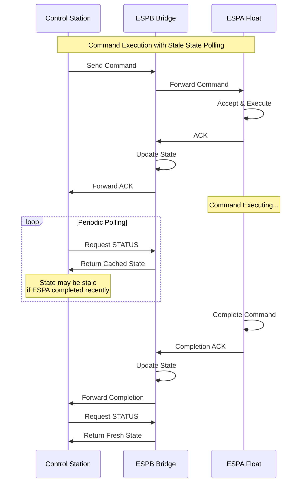

# PoliTOcean Float 2025 - Technical Documentation

[](https://github.com/PoliTOcean/Float_2025/actions/workflows/ci.yml)

**Version:** 11.2.0
**Team:** PoliTOcean @ Politecnico di Torino  
**Maintainers:** Colabella Davide, Benevenga Filippo  
**Competition:** MATE ROV 2025/26

--------------------------------------------------------------------------

## TABLE OF CONTENTS

- [PoliTOcean Float 2025 - Technical Documentation](#politocean-float-2025---technical-documentation)
  - [TABLE OF CONTENTS](#table-of-contents)
  - [PROJECT OVERVIEW](#project-overview)
    - [Introduction and Requirements](#introduction-and-requirements)
    - [System Behavior](#system-behavior)
  - [HARDWARE CONFIGURATION](#hardware-configuration)
    - [Hardware Used](#hardware-used)
    - [Pin Mapping](#pin-mapping)
      - [ESPA (Float Controller) Pin Mapping:](#espa-float-controller-pin-mapping)
      - [ESPB (Communication Bridge) Pin Mapping:](#espb-communication-bridge-pin-mapping)
    - [I2C Device Addresses:](#i2c-device-addresses)
  - [SYSTEM ARCHITECTURE](#system-architecture)
    - [Deployment Diagram](#deployment-diagram)
    - [Software Structure](#software-structure)
    - [ESPA State Machine](#espa-state-machine)
  - [COMMUNICATION PROTOCOL](#communication-protocol)
    - [Command Lifecycle](#command-lifecycle)
    - [ESPB Bridge Role](#espb-bridge-role)
    - [FLOAT Commands](#float-commands)
    - [STATUS COMMAND: ESPB RESPONSE](#status-command-espb-response)
    - [GUI / ESPB / ESPA Protocol Contract](#gui--espb--espa-protocol-contract)
  - [LED STATUS INDICATORS](#led-status-indicators)
    - [ESPA (Float Board) LED States:](#espa-float-board-led-states)
    - [ESPB (Communication Bridge) LED States:](#espb-communication-bridge-led-states)
  - [DEVELOPMENT AND TESTING](#development-and-testing)
    - [PlatformIO Environments](#platformio-environments)
    - [CLI Startup](#cli-startup)
    - [CLI Tests](#cli-tests)
    - [Manual Motor-Only Control](#manual-motor-only-control)
    - [Test Layout](#test-layout)
  - [UTILITIES AND RESOURCES](#utilities-and-resources)
  - [GLOSSARY](#glossary)

--------------------------------------------------------------------------

## PROJECT OVERVIEW

### Introduction and Requirements

By MATE 2026 requirements documentation (Task 4.1 - MATE Floats Under the Ice), the FLOAT must complete operational vertical profiling missions under simulated ice conditions.

**Pre-Deployment Requirements:**
- The FLOAT must communicate with the Mission Station (CS) prior to descending, transmitting a **defined data packet** containing:
  - Company number (provided by MATE)
  - Time data (UTC/local/float time)
  - Pressure data (pa or kpa) and/or depth data (m or cm)
  - Additional data as required
- Example packet: `EX01 1:51:42 UTC 9.8 kpa 1.00 meters`

**Vertical Profile Requirements:**

The FLOAT must complete **two vertical profiles** using a buoyancy engine (fluid displacement system, not thrusters). Each profile consists of:

1. **Descent Phase**: Descend from surface to **2.5 meters depth** (± 33 cm)
2. **Deep Hold**: Maintain depth at **2.5 meters** for **30 seconds** (bottom of float as reference)
3. **Ascent Phase**: Rise to **40 cm depth** (± 33 cm) without breaking surface or contacting ice
4. **Shallow Hold**: Maintain depth at **40 cm** for **30 seconds** (top of float as reference)

**Data Collection & Transmission:**

- Collect depth/pressure measurements during both profiles and keep them locally while the antenna is underwater.
- Store data in ESP32 internal flash as a LittleFS CSV containing: company number, profile id, time, pressure, judge/reference depth, phase, raw sensor depth, and normalized syringe position `syringe_u`.
- After surfacing/recovery, replay selected data packets to the Mission Station at the configured packet cadence (`DATA_PACKET_PERIOD_MS`, default 5 s).
- Data packets must show **7 sequential measurements** (spanning 30 seconds at 5-second intervals: 0, 5, 10, 15, 20, 25, 30) confirming proper depth maintenance at both 2.5m and 0.4m

**Post-Mission Requirements:**

- Upon surface recovery, make buffered flash-backed profile data available to the CS.
- CS GUI fetches the stored profile after the `LISTENING` command.
- The active GUI plots depth, pressure, and normalized syringe position over time; the judging requirement still only mandates depth over time.

**Current firmware storage note:** the active implementation uses the internal flash CSV log (`FLASH_LOG_PATH`) as the primary mission data source. EEPROM compact records remain only as an internal legacy buffer. The legacy serial command name is still `CLEAR_SD`, but it now resets the flash CSV log and the legacy EEPROM buffer.

**Auto Mode (AM):**

An autonomous operating mode that triggers profile execution in case of connection loss with the CS, ensuring mission completion if communication is temporarily unavailable. AM will autonomously commit the configured runtime profile count when connection is lost, preventing incomplete missions due to transient WiFi failures.

**Penalties:**
- Breaking surface or contacting ice sheet during profile: **-5 points per profile**
- FLOAT must remain submerged between 40 cm and 2.5 m throughout the ascent/descent phases

### System Behavior

The general idea is that the FLOAT provides some micro-services that the CS can activate by sending commands to it. Every command can be requested at any moment, with the only limit that a command can be accepted by the FLOAT only when the previous one has been completed (more info on command cycle later). 

The FLOAT has two main logical states: the command execution one, and the idle one in which it waits for the new command. In idle state, the FLOAT can have buffered flash data from the last completed profile that can be sent to the CS.

#### Syringe / Motor Convention

The FLOAT changes its buoyancy by pulling and pushing water through a pair of syringes driven by a stepper motor through a lead screw. The mechanical convention is:

- **Home (`motor_pos = 0`)**: plate/piston far from the TOF, water pushed out, **syringes empty** → the FLOAT floats. At this position the TOF reads ≈ `TOF_HOMING_THRESHOLD` (75 mm).
- **Sink direction (`motor_pos < 0`)**: plate moves toward the TOF, the syringes take in water, and the FLOAT sinks. Full logical extension is `uToMotorPos(1.0f) = -(MOTOR_MAX_STEPS - 2*MOTOR_ENDSTOP_MARGIN)`.
- **PID/profile logical convention**: `u ∈ [0, 1]` with `u = 0` → float (empty) and `u = 1` → sink (full). `uToMotorPos(u)` maps logical `u` to motor steps, and `motorPosToU(position)` converts the measured motor position back to the logged `syringe_u`.

TOF safety limits used during motion:

| Constant | Default | Meaning |
|---|---|---|
| `TOF_HOMING_THRESHOLD` | 75 mm | Phase 2 of homing stops when the TOF reads above this |
| `TOF_HOMING_APPROACH_MM` | 50 mm | Phase 1 of homing stops when the TOF reads below this |
| `TOF_SAFE_RANGE_MIN_MM` | 40 mm | Lower bound: syringe fully extended (mechanical limit) |
| `TOF_SAFE_RANGE_MAX_MM` | 85 mm | Upper bound: 10 mm above the homing threshold; any higher and the piston would risk hitting the back mechanical stop |

#### Surface Target Offset

When the FLOAT is "floating", we usually want its top a few centimetres below the water surface — not exactly at the waterline — so that the float remains visible without being completely above water. This is controlled by `SURFACE_TARGET_OFFSET_M` (default `0.10` m: top of the float 10 cm below the surface).

Two ways to change it:

- **At compile time**: edit `SURFACE_TARGET_OFFSET_M` in `include/config.h`.
- **At runtime**: set the profile surface offset from NEXUS/GUI to persist it on ESPA, or send `SURFACE_OFFSET <m>` via CS/USB for a temporary tuning change until reboot.

The offset is geometry-agnostic: `FLOAT_TOP_TO_SENSOR_M` (geometric distance between the top of the float and the barometer) and `SURFACE_TARGET_OFFSET_M` (operational target) are kept as separate constants in `include/config.h`.

--------------------------------------------------------------------------

## HARDWARE CONFIGURATION

### Hardware Used

| Hardware | Role | Link | Key parameters / notes |
|:---------|:-----|:-----|:-----------------------|
| ESP32 Dev Module x2 | ESPA float controller and ESPB communication bridge | [Espressif ESP32](https://documentation.espressif.com/esp32-wroom-32e_esp32-wroom-32ue_datasheet_en.pdf) | Arduino framework, ESP-NOW link, USB serial bridge on ESPB |
| DRV8825 stepper driver | Stepper motor driver for syringe motion | [Pololu DRV8825 carrier](https://www.pololu.com/product/2133) | STEP/DIR control, active-low enable, SLEEP and RESET held HIGH during operation |
| Stepper motor with planetary gearbox | Syringe actuator motor | [StepperOnline 17HS15-1684S-PG27](https://www.omc-stepperonline.com/it/nema-17-motore-passo-passo-bipolare-l-38mm-w-rapporto-di-riduzione-27-1-riduttore-epicicloidale-17hs15-1684s-pg27) | NEMA 17, 200 steps/rev, 1.8 deg/step, configured gear ratio 26.85124:1, microstep setting 1 |
| Lead screw / threaded rod | Converts motor rotation to linear travel | [SIENOC 500 mm trapezoidal lead screw](https://www.amazon.it/SIENOC-500mm-Stampante-Trapezoidale-Piombo/dp/B078K7KN8W/) | Pitch 2.0 mm, 4 starts, lead 8.0 mm/rev, configured travel 35 mm |
| VL53L7CX Time-of-Flight sensor | Non-contact homing distance sensor (multi-zone) | [ST VL53L7CX](https://www.st.com/en/imaging-and-photonics-solutions/vl53l7cx.html) | I2C 0x29, LPn (XSHUT) GPIO16, GPIO1 GPIO15, 4×4 zone mode with central-zone mask `0x0660`, 6 mm raw offset, 75 mm homing threshold |
| Bar02 pressure sensor | Pressure/depth measurement | [Blue Robotics Bar02](https://bluerobotics.com/store/sensors-cameras/sensors/bar02-sensor-r1/) | MS5837_02BA model, I2C 0x76, used for depth and pressure |
| INA219 battery monitor | Battery bus-voltage monitor | [Adafruit INA219 breakout](https://www.adafruit.com/product/904) | I2C 0x40, initialized at 100 kHz, configured with 5 A max and 0.1 ohm shunt |

### Pin Mapping

#### ESPA (Float Controller) Pin Mapping:

| Function | GPIO Pin | Connected To | Notes |
|:---------|:--------:|:------------|:------|
| **Motor Control** ||||
| DIR | GPIO32 | DRV8825 Direction | Stepper direction control |
| STEP | GPIO33 | DRV8825 Step | Step pulse generation |
| EN | GPIO27 | DRV8825 Enable | Active-LOW, disables outputs when HIGH |
| SLEEP | GPIO25 | DRV8825 Sleep | Active-LOW, must be HIGH for operation |
| RST | GPIO26 | DRV8825 Reset | Active-LOW, must be HIGH for operation |
| **TOF Sensor** ||||
| SDA | GPIO21 | VL53L7CX I2C Data | I2C bus (shared with sensors) |
| SCL | GPIO22 | VL53L7CX I2C Clock | I2C bus @ 1MHz |
| XSHUT | GPIO16 | VL53L7CX LPn (shutdown) | Sensor enable / shutdown control |
| GPIO1 | GPIO15 | VL53L7CX Interrupt | Optional interrupt pin, unused in polling mode |
| **Sensors** ||||
| SDA | GPIO21 | Bar02, INA219 | I2C bus (shared) |
| SCL | GPIO22 | Bar02, INA219 | I2C bus (shared) |
| **Status LED** ||||
| LED_R | GPIO19 | Red Channel | PWM control |
| LED_G | GPIO18 | Green Channel | PWM control |
| LED_B | GPIO5 | Blue Channel | PWM control |

#### ESPB (Communication Bridge) Pin Mapping:

| Function | GPIO Pin | Connected To | Notes |
|:---------|:--------:|:------------|:------|
| **Communication** ||||
| TX | GPIO1 | USB Serial | 115200 baud |
| RX | GPIO3 | USB Serial | 115200 baud |
| **Status LED** ||||
| Built-in LED | GPIO2 | Onboard LED | Status indication |

### I2C Device Addresses:

| Device | Address | Bus Speed |
|:-------|:-------:|:---------|
| VL53L7CX TOF | 0x29 | 1 MHz |
| Bar02 Pressure | 0x76 | Shared I2C bus |
| INA219 Battery | 0x40 | Initialized at 100 kHz |

> The firmware initializes the INA219 at 100 kHz, then the VL53L7CX driver raises the shared `Wire` clock to 1 MHz for TOF ranging.

--------------------------------------------------------------------------

## SYSTEM ARCHITECTURE

### Deployment Diagram

FLOAT code has to be deployed on two ESP32, one mounted on the FLOAT board (ESPA) together with the sensors and the power supply, and the other (ESPB) communicating with the Control Station via USB. The two ESP32 communicates via WiFi using ESP-NOW protocol. The software on the two ESP32 is designed to work regardless of the design of the GUI on the CS. 

The idea is to bring all the complexity on the ESPA and GUI, leaving no trace of logic on the ESPB.


```mermaid
graph TB
    subgraph "Control Station"
        GUI[GUI Application]
        USB[USB Serial]
    end
    
    subgraph "ESPB - Communication Bridge"
        ESPB_FW[ESPB Firmware]
        ESPB_WiFi[WiFi ESP-NOW]
        ESPB_LED[Built-in LED]
    end
    
    subgraph "ESPA - Float Controller"
        ESPA_FW[ESPA Firmware]
        ESPA_WiFi[WiFi ESP-NOW]
        
        subgraph "Motor System"
            DRV8825[DRV8825 Driver]
            STEPPER[Stepper Motor]
            TOF[VL53L7CX TOF Sensor]
        end
        
        subgraph "Sensors"
            BAR02[Bar02 Pressure]
            INA219[INA219 Battery]
        end
        
        RGB[RGB LED]
        I2C[I2C Bus]
    end
    
    GUI -->|Commands| USB
    USB <-->|Serial 115200| ESPB_FW
    ESPB_FW <-->|ESP-NOW 2.4GHz| ESPB_WiFi
    ESPB_WiFi <-.->|WiFi| ESPA_WiFi
    ESPA_WiFi <-->|ESP-NOW| ESPA_FW
    
    ESPA_FW -->|Control Signals| DRV8825
    DRV8825 -->|STEP/DIR| STEPPER
    TOF -->|Distance Data| ESPA_FW
    
    BAR02 -->|I2C| I2C
    INA219 -->|I2C| I2C
    I2C -->|Sensor Data| ESPA_FW
    
    ESPA_FW -->|Status| RGB
    ESPB_FW -->|Status| ESPB_LED
    
    style ESPA_FW fill:#4CAF50
    style ESPB_FW fill:#2196F3
    style GUI fill:#FF9800
    style TOF fill:#9C27B0
```

### Software Structure

The project follows a modular architecture with separate compilation units:
- **Central Config** (`include/config.h`) - pin mapping, motor constants, PID defaults, mission timing, network parameters
- **Shared Protocol** (`include/float_common.h`) - ESP-NOW packet structs, ACK strings, EEPROM size, shared LED enum
- **Motor Control** (`lib/motor`) - DRV8825/FastAccelStepper setup, position tracking, bounded movement primitives
- **TOF Sensor** (`lib/tof`) - VL53L7CX initialization (4×4 multi-zone), aggregated minimum-distance reading with raw offset compensation
- **Motion Control** (`lib/motion_control`) - TOF homing, safe max-extension move, balance routine, emergency stop handling
- **Communication** (`lib/comms`) - ESP-NOW wireless protocol and ElegantOTA session management
- **Sensors** (`lib/sensors`) - Bar02 pressure/depth and INA219 battery monitoring
- **PID Controller** (`lib/pid`) - depth control algorithm with runtime gain updates
- **Runtime Config** (`lib/runtime_config`) - persisted PID, balance, and motor settings
- **Profile Manager** (`lib/profile`) - mission profile execution and flash-backed mission logging
- **Flash Storage** (`lib/flash_storage`) - LittleFS CSV mission log and replay helpers
- **LED Controller** (`lib/led`) - RGB status indication system

### ESPA State Machine

The ESPA firmware operates as a state machine coordinating motor control, sensors, and communications:


```mermaid
stateDiagram-v2
    [*] --> INIT: Power On
    
    INIT --> HOMING: Sensors OK
    INIT --> ERROR: Init Failed
    
    HOMING --> IDLE: Homing Success
    HOMING --> ERROR: Homing Failed/Timeout
    
    IDLE --> EXECUTING: Command Received
    IDLE --> IDLE: No Command
    
    EXECUTING --> PROFILE: GO Command
    EXECUTING --> BALANCE: BALANCE Command
    EXECUTING --> SEND_DATA: LISTENING Command
    EXECUTING --> CLEAR_DATA: CLEAR_SD Command
    EXECUTING --> UPDATE_PID: PID_CONFIG_SET Command
    EXECUTING --> READ_CONFIG: *_CONFIG_GET Command
    EXECUTING --> UPDATE_CONFIG: PROFILE/BALANCE/MOTOR_CONFIG_SET Command
    EXECUTING --> TEST_STEPS: TEST_STEPS Command
    EXECUTING --> DEBUG_MODE: DEBUG Command
    EXECUTING --> HOMING: HOME_MOTOR Command
    EXECUTING --> OTA: TRY_UPLOAD Command
    EXECUTING --> SYRINGE_SET: SYRINGE_SET Command
    EXECUTING --> PID_HOLD: PID_HOLD Command
    EXECUTING --> PID_STEP: PID_STEP Command
    EXECUTING --> SET_SURFACE_OFFSET: SURFACE_OFFSET Command
    
    PROFILE --> PID_CONTROL: Descending
    PID_CONTROL --> PID_CONTROL: Depth Control Active
    PID_CONTROL --> ASCENT: Target Reached/Timeout
    ASCENT --> IDLE_W_DATA: At Surface
    
    BALANCE --> IDLE: Balance Complete
    SEND_DATA --> IDLE: Data Sent
    CLEAR_DATA --> IDLE: Flash Log Cleared
    UPDATE_PID --> IDLE: PID Config Stored
    READ_CONFIG --> IDLE: JSON Sent
    UPDATE_CONFIG --> IDLE: Runtime Config Stored
    TEST_STEPS --> IDLE: Test Move Complete
    DEBUG_MODE --> IDLE: Debug Toggle Complete
    OTA --> IDLE: Upload Complete
    SYRINGE_SET --> IDLE: Bench Test Complete
    PID_HOLD --> IDLE: Hold Complete / Timeout
    PID_STEP --> IDLE: Step Complete / Timeout
    SET_SURFACE_OFFSET --> IDLE: Offset Stored
    
    IDLE_W_DATA --> SENDING: LISTENING Command
    SENDING --> IDLE: Data Transmitted
    
    ERROR --> [*]: Manual Reset Required
    
    note right of IDLE
        RGB: Green Solid
        Waiting for command
    end note
    
    note right of HOMING
        RGB: Purple Blink
        TOF-based homing
    end note
    
    note right of PID_CONTROL
        RGB: Cyan Blink
        Active depth control
    end note
    
    note right of ERROR
        RGB: Red Blink
        Fatal error state
    end note
```

--------------------------------------------------------------------------

## COMMUNICATION PROTOCOL

### Command Lifecycle

A command life-cycle does not overlaps/interfere with the previous nor the next one: when the CS sends a command (and it arrives to the FLOAT), a feedback from the FLOAT should inform about the acceptance of the command and if this acknowledgement arrives within a given period (specified later), next command requests will be ignored until end of execution of the current one, signaled by an idle acknowledgement. 

If the acknowledgement doesn't arrive within that time span, the command commit can be considered failed: this could happen for WiFi connection failures or FLOAT electronics issues. 

When waiting for the command commit acknowledgement, other command requests will be ignored as well.   

As already mentioned, after command completion the FLOAT will try to send an idle acknowledgement to signal that it is listening for a new command: together with the idle state, this acknowledgement can also inform about the presence of new flash-backed profile data that has to be sent to the CS. After an idle acknowledgement is received, a new command can be accepted.

To maintain consistency with the status stored on the ESPB, and hence with the GUI visuals, the FLOAT grants to send the acknowledgement signalling a command commit only when the commit can be given for sure. In the same way, if the acknowledgement fails to be sent due to connection issues, the command is not committed.


```mermaid
sequenceDiagram
    participant CS as Control Station
    participant ESPB as ESPB Bridge
    participant WiFi as ESP-NOW
    participant ESPA as ESPA Float
    
    Note over CS,ESPA: Command Execution with Fresh State
    
    CS->>ESPB: Send Command (e.g., "GO")
    ESPB->>WiFi: Forward Command
    WiFi->>ESPA: Deliver Command
    
    ESPA->>ESPA: Validate & Accept
    ESPA->>WiFi: ACK (e.g., "GO_RECVD")
    WiFi->>ESPB: Deliver ACK
    ESPB->>ESPB: Update State (status=2)
    ESPB->>CS: Forward ACK
    
    Note over ESPA: Executing Command...
    
    ESPA->>ESPA: Complete Task
    ESPA->>WiFi: Completion ACK (e.g., "FLOAT_IDLE")
    WiFi->>ESPB: Deliver Completion
    ESPB->>ESPB: Update State (status=0)
    ESPB->>CS: Forward Completion
    
    Note over CS: Ready for Next Command
```

### ESPB Bridge Role

The ESPB role is only to make the CS task of continuously checking on the WiFi channel less resource consuming. 

In particular, ESPB receives commands from CS via USB only to forward them to the FLOAT via WiFi. At the same time, it can receive feedback and data from the FLOAT. In the latter case the ESPB will forward the packages on the USB channel, while using them to update an internal state accordingly. The only code that should trigger the update of the state stored on ESPB is the firmware on the FLOAT, via the data and the feedback sent to CS (more later). This is because no assumptions have to be done by other software on the commands completion and acceptance. 

The ESPB state should mirror the FLOAT state at each moment (more details later) and can be used by the GUI to give visual feedback to the user or to drive its internal logic. It can be requested to the ESPB by the CS at any moment with a specific command. The state info sent to the CS with this command also contains WiFi connection state info and AM activation state info.  

In general, the ESPB feedback could be stale when requested (for example because the CS could poll it with a low frequency), so to get fresh, real-time data the CS should listen on the USB channel for the FLOAT packages, after a command request or when waiting for command completion and retrieve the FLOAT current state directly by those packages.  

Periodic polling remains a legit choice in case the CS cannot exploit interrupts triggered by Serial connection, but notice that this solution leads to delayed GUI visual feedback with respect to the changes on the FLOAT state.  

In some cases, connection losses can undermine consistency between the feedback of the ESPB (either they are polled or real time) and the real current FLOAT state (consistency threats for each FLOAT state later).


```mermaid
sequenceDiagram
    participant CS as Control Station
    participant ESPB as ESPB Bridge
    participant ESPA as ESPA Float
    
    Note over CS,ESPA: Command Execution with Stale State Polling
    
    CS->>ESPB: Send Command
    ESPB->>ESPA: Forward Command
    ESPA->>ESPA: Accept & Execute
    ESPA->>ESPB: ACK
    ESPB->>ESPB: Update State
    ESPB->>CS: Forward ACK
    
    Note over ESPA: Command Executing...
    
    loop Periodic Polling
        CS->>ESPB: Request STATUS
        ESPB->>CS: Return Cached State
        Note over CS: State may be stale<br/>if ESPA completed recently
    end
    
    ESPA->>ESPA: Complete Command
    ESPA->>ESPB: Completion ACK
    ESPB->>ESPB: Update State
    ESPB->>CS: Forward Completion
    
    CS->>ESPB: Request STATUS
    ESPB->>CS: Return Fresh State
```

### FLOAT Commands

Table of FLOAT commands with relative effects and acknowledgements:

|    Cmd string    | Cmd ESPA number | Cmd effects                                                                                                                                                     |       ESPA ack string       |      ESPA ack effects on ESPB state       |
| :--------------: | :-------------: | --------------------------------------------------------------------------------------------------------------------------------------------------------------- | :-------------------------: | :---------------------------------------: |
|        GO        |        1        | Runs the configured runtime profile sequence, sends the pre-descent data packet before the first descent, and logs pressure/depth/syringe records to flash CSV    |          GO_RECVD           |    status to 2 (command execution)<br>    |
|    LISTENING     |        2        | Replays stored flash CSV records as JSON data packets after recovery/fetch, filtered by `DATA_PACKET_PERIOD_MS`, followed by `STOP_DATA`                         |     Ack is data itself      |  status to 2 after first package arrival  |
|     BALANCE      |        3        | Cycles full extension and retraction with `holdMs` holds until Bar02 pressure rises above the startup baseline by `BALANCE_STOP_PRESSURE_DELTA_KPA`. Requires the motor to be homed first — otherwise the command fails with `Balance: homing required` | CMD3_RECVD | status to 2 |
|     CLEAR_SD     |        4        | Clears and recreates the flash CSV log, and clears the legacy EEPROM buffer. The command string is kept as `CLEAR_SD` for compatibility                          |         CMD4_RECVD          |                status to 2                |
| SWITCH_AUTO_MODE |        5        | Toggles FLOAT Auto Mode                                                                                                                                          |       SWITCH_AM_RECVD       | status to 2, AM activation state toggled  |
|   SEND_PACKAGE   |        6        | Sends a single live JSON snapshot containing company number, time, pressure, judge/reference depth, phase, raw sensor depth, and `syringe_u`                    |  Ack is the package itself  |                status to 2                |
|    TRY_UPLOAD    |        7        | Starts the ElegantOTA access point on ESPA for a 5-minute upload window, then restores ESP-NOW                                                                    |       TRY_UPLOAD_RECVD      |                status to 2                |
| `PID_CONFIG_SET kp ki kd period_ms alpha_d integral_limit min_retarget_frac u_neutral` | 8 | Updates and persists PID runtime configuration                                                    |      PID_CONFIG_SET_RECVD   |                status to 2                |
| reserved          |        9        | Reserved for backwards-compatible command numbering                                                                                                            |              -              |                    -                      |
| `TEST_STEPS n`   |       10        | Moves the motor by `n` relative steps at the configured motor test speed                                                                                        |      TEST_STEPS_RECVD       |                status to 2                |
|      DEBUG       |       11        | Toggles remote debug forwarding through `DebugSerial`                                                                                                            |      DEBUG_MODE_RECVD       |                status to 2                |
|    HOME_MOTOR    |       12        | Runs TOF-based homing remotely                                                                                                                                   |          HOME_RECVD         |                status to 2                |
|       STOP       |       13        | Triggers a remote emergency stop, stops the motor, disables outputs, and returns to idle                                                                          |         STOP_RECVD          |                status to 2                |
| `PID_CONFIG_GET` |       14        | Returns current PID runtime configuration as JSON                                                                                                                |          JSON packet         |                status to 2                |
| `SYRINGE_SET u dur_s` | 15      | Bench test: drives the syringe to normalized position `u ∈ [0,1]` for `dur_s` seconds, logging depth — bypasses the PID (DC gain / time-constant characterization) | SYRINGE_SET_RECVD           |                status to 2                |
| `PID_HOLD depth dur_s` | 16     | Bench test: holds depth at `depth_m` for `dur_s` seconds with the PID active, logging at 5 Hz                                                                    | PID_HOLD_RECVD              |                status to 2                |
| `PID_STEP depth` |        17       | Bench test: step response — drives the PID to `depth_m` for up to 60 s, logging at 10 Hz                                                                          | PID_STEP_RECVD              |                status to 2                |
| `SURFACE_OFFSET m` |     18        | Sets the surface target offset (`SURFACE_TARGET_OFFSET_M`) at runtime: the FLOAT will hold its top `m` metres below the waterline when "floating" (default `0.10`) | SURFACE_OFF_RECVD           |                status to 2                |
| `PROFILE_SET count deep shallow_top tol hold pid_timeout ascent_timeout surface_offset` | 19 | Updates and persists mission profile configuration used by `GO`                                                                                  | PROFILE_SET_RECVD / PROFILE_SET_ERR | status to 2 |
| `PROFILE_GET` | 20 | Returns current mission profile configuration as JSON                                                                                                           | JSON packet | status to 2 |
| `BALANCE_CONFIG_SET hold_ms stop_delta_kpa stop_samples sample_period_ms` | 21 | Updates and persists balance routine configuration                                                                         | BALANCE_CONFIG_SET_RECVD / BALANCE_CONFIG_SET_ERR | status to 2 |
| `BALANCE_CONFIG_GET` | 22 | Returns current balance configuration as JSON                                                                                                  | JSON packet | status to 2 |
| `MOTOR_CONFIG_SET max_speed max_accel homing_speed test_speed` | 23 | Updates and persists motor speed/acceleration configuration                                                                 | MOTOR_CONFIG_SET_RECVD / MOTOR_CONFIG_SET_ERR | status to 2 |
| `MOTOR_CONFIG_GET` | 24 | Returns current motor configuration as JSON                                                                                                    | JSON packet | status to 2 |
|      STATUS      |        -        | Requests stale ESPB status plus AM state, WiFi connection state, battery millivolts, and last RSSI                                                               |              -              |                     -                     |

Once a command is completed, ESPA acknowledgement can be:

| ESPA ack string   | ESPA ack effects on ESPB state          | ESPA state                                  |
| ----------------- | --------------------------------------- | ------------------------------------------- |
| FLOAT_IDLE        | status to 0 (idle)                      | Idle with no data to be sent                |
| FLOAT_IDLE_W_DATA | status to 1 (idle with data to be sent) | Idle with data from last profile to be sent |

### STATUS COMMAND: ESPB RESPONSE

ESPB response to **STATUS** command is composed by five parts of information: ESPA state (stale), activation of the AM on the FLOAT, WiFi connection state, last received battery millivolts, and last received RSSI. The WiFi connection state is detected by sending a dummy command code `0`, while the other states are kept consistent with the ones on the FLOAT by updating them after acknowledgements reception.

**ESPA state:**

| ESPB state string | ESPB state number | State description                                                                                                     |
| :---------------: | :---------------: | --------------------------------------------------------------------------------------------------------------------- |
|      UNKNOWN      |        -1         | ESPB has not received any state message from ESPA since boot                                                          |
|     CONNECTED     |         0         | The FLOAT is listening for new command. Previous command succeeded                                                    |
| CONNECTED_W_DATA  |         1         | The FLOAT is listening for new command and has some new data from last profile to be sent. Previous command succeeded |
|   EXECUTING_CMD   |         2         | FLOAT is executing a command                                                                                          |
|   STATUS_ERROR    |         -         | Internal error in reading the state number                                                                            |

> **WARNING:**  
> If committing a profile automatically, the relative acknowledgement will likely fail due to connection loss. The profile is committed anyway as it is generated from connection loss in the first place, but the GUI may not have mean to detect it. So it will likely read an **inconsistent idle status** (CONNECTED or CONNECTED_W_DATA) until FLOAT is at water level with a stable WiFi connection. In the meantime the command commits will fail, for connection loss or because the FLOAT is underwater. Anyway WiFi connection state can be detected by the STATUS command, hence giving feedback on status consistency.
> 
> ```mermaid
> sequenceDiagram
>     participant CS as Control Station
>     participant ESPB as ESPB Bridge
>     participant ESPA as ESPA Float
>     
>     Note over ESPA: Auto Mode Active
>     Note over ESPA,ESPB: Connection Lost!
>     
>     ESPA->>ESPA: Detect Connection Loss
>     ESPA->>ESPA: Auto-commit Profile
>     
>     Note over ESPA: Descending...<br/>WiFi Unavailable
>     
>     ESPA-xESPB: ACK Fails (No Connection)
>     
>     Note over ESPB: State Becomes Inconsistent<br/>Still shows "IDLE"
>     
>     CS->>ESPB: Request STATUS
>     ESPB->>CS: CONNECTED | CONN_LOST
>     Note over CS: GUI shows inconsistent state<br/>but WiFi loss detected
>     
>     Note over ESPA: At Surface...<br/>WiFi Restored
>     
>     ESPA->>ESPB: FLOAT_IDLE_W_DATA
>     ESPB->>ESPB: Update to Consistent State
>     ESPB->>CS: Forward State
>     
>     Note over CS,ESPA: Consistency Restored
> ```

**AM state:**

| ESPB state string | State description                                                         |
| :---------------: | ------------------------------------------------------------------------- |
|   AUTO_MODE_YES   | AM on FLOAT is activated                                                  |
|   AUTO_MODE_NO    | AM on FLOAT is not activated: connection losses will not trigger profiles |

**WiFi connection state:**

| ESPB state string | State description                                            |
| :---------------: | ------------------------------------------------------------ |
|      CONN_OK      | WiFi connection is ok                                        |
|     CONN_LOST     | WiFi connection is currently down. ESPB state could be wrong |

**Battery and RSSI fields:**

| ESPB field | State description |
| :--------: | ------------------------------------------------------------ |
| `BATTERY: <mV>` | Last battery voltage received from ESPA acknowledgements |
| `RSSI: <dBm>` | Last ESP-NOW packet RSSI captured by ESPB promiscuous callback |

**Example of ESPB state response:** `CONNECTED_W_DATA | AUTO_MODE_NO | CONN_OK | BATTERY: 12450 | RSSI: -63`

At ESPB boot, before any ESPA packet is received, a status request may return:
`UNKNOWN | AUTO_MODE_NO | CONN_LOST | BATTERY: 0 | RSSI: 0`.

### GUI / ESPB / ESPA Protocol Contract

The GUI sends command strings to ESPB over USB serial. ESPB parses the string, sends the command number to ESPA over ESP-NOW, and forwards ESPA acknowledgements/data back to the GUI.

| GUI command | ESPA command number | ESPA acknowledgement / response |
| :---------- | :-----------------: | :------------------------------ |
| `GO` | 1 | `GO_RECVD` |
| `LISTENING` | 2 | Stored data packets, then `STOP_DATA` |
| `BALANCE` | 3 | `CMD3_RECVD` |
| `CLEAR_SD` | 4 | `CMD4_RECVD` |
| `SWITCH_AUTO_MODE` | 5 | `SWITCH_AM_RECVD` |
| `SEND_PACKAGE` | 6 | Live JSON packet |
| `TRY_UPLOAD` | 7 | `TRY_UPLOAD_RECVD` |
| `PID_CONFIG_SET kp ki kd period_ms alpha_d integral_limit min_retarget_frac u_neutral` | 8 | `PID_CONFIG_SET_RECVD` / `PID_CONFIG_SET_ERR` |
| `TEST_STEPS n` | 10 | `TEST_STEPS_RECVD` |
| `DEBUG` | 11 | `DEBUG_MODE_RECVD` |
| `HOME_MOTOR` | 12 | `HOME_RECVD` |
| `STOP` | 13 | `STOP_RECVD` |
| `PID_CONFIG_GET` | 14 | PID config JSON |
| `SYRINGE_SET u dur_s` | 15 | `SYRINGE_SET_RECVD` |
| `PID_HOLD depth_m dur_s` | 16 | `PID_HOLD_RECVD` |
| `PID_STEP depth_m` | 17 | `PID_STEP_RECVD` |
| `SURFACE_OFFSET m` | 18 | `SURFACE_OFF_RECVD` |
| `PROFILE_SET count deep shallow_top tol hold pid_timeout ascent_timeout surface_offset` | 19 | `PROFILE_SET_RECVD` / `PROFILE_SET_ERR` |
| `PROFILE_GET` | 20 | Profile JSON |
| `BALANCE_CONFIG_SET hold_ms stop_delta_kpa stop_samples sample_period_ms` | 21 | `BALANCE_CONFIG_SET_RECVD` / `BALANCE_CONFIG_SET_ERR` |
| `BALANCE_CONFIG_GET` | 22 | Balance config JSON |
| `MOTOR_CONFIG_SET max_speed max_accel homing_speed test_speed` | 23 | `MOTOR_CONFIG_SET_RECVD` / `MOTOR_CONFIG_SET_ERR` |
| `MOTOR_CONFIG_GET` | 24 | Motor config JSON |
| `STATUS` | - | ESPB local status line with five pipe-separated fields |

The peer MAC addresses are configured centrally in `include/config.h`: `MAC_ESPA` is used by ESPB, and `MAC_ESPB` is used by ESPA.

--------------------------------------------------------------------------

## LED STATUS INDICATORS

The FLOAT is equipped with RGB LEDs on both ESP32 boards that provide visual feedback about the system status:

### ESPA (Float Board) LED States:

Driven by `LEDState` (scoped enum in [`lib/led/include/led.h`](lib/led/include/led.h)):

| LED Color/Pattern | State | Description |
|:----------------:|:-----:|:------------|
| **Green Solid / Boot Blinks** | `LEDState::INIT` | System initializing |
| **Green Solid** | `LEDState::IDLE` | Ready and idle, waiting for commands |
| **Green Blink** | `LEDState::IDLE_WITH_DATA` | Idle with data ready to send |
| **Red Solid** | `LEDState::LOW_BATTERY` | Battery voltage below `BATT_THRESH` (12.0 V) |
| **Red Blink** | `LEDState::ERROR` | Error state or motor emergency stop |
| **Blue Solid** | `LEDState::PROFILE` | Running non-PID profile phase |
| **Yellow Blink** | `LEDState::AUTO_MODE` | Auto mode active |
| **Purple Blink** | `LEDState::HOMING` | Motor homing in progress |
| **Purple Solid** | `LEDState::MOTOR_MOVING` | Motor moving |
| **Cyan Blink** | `LEDState::PID_CONTROL` | PID depth control active |
| **White Solid** | `LEDState::COMMUNICATION` | Command received / communicating with ESPB |
| **Orange Blink** | `LEDState::OTA_MODE` | OTA update mode active |
| **Off** | `LEDState::OFF` | System off or disabled |

> ESPA and ESPB share the logical `LEDState` enum from [`include/float_common.h`](include/float_common.h). ESPA maps every state to the external RGB LED; ESPB maps only the built-in LED states it can represent.

### ESPB (Communication Bridge) LED States:

| LED Pattern | State | Description |
|:----------------:|:-----:|:------------|
| **Solid On** | `LEDState::IDLE` | Connected and ready |
| **Very Fast Blink** | `LEDState::ERROR` | Communication error |
| **Off** | `LEDState::OFF` | System off or disabled |

> **Note**: ESPB uses the built-in LED (pin 2) with different blink patterns to indicate status, as it does not have external RGB connections.

--------------------------------------------------------------------------

## DEVELOPMENT AND TESTING

### PlatformIO Environments

| Environment | Purpose | Main Source |
|:------------|:--------|:------------|
| `espA` | Float controller firmware with sensors, TOF homing, motion control, PID, ESP-NOW, and OTA | `src/espA/main.cpp` |
| `espB` | USB-to-ESP-NOW bridge for the Control Station | `src/espB/main.cpp` |
| `espA_manual_keyboard` | Bench firmware for serial keyboard continuous motor movement without homing | `src/espA_manual_keyboard/main.cpp` |

Common commands:

```bash
pio run -e espA
pio run -e espB
pio run -e espA_manual_keyboard
pio test -e espA
```

### CLI Startup

Run all commands from the project root:

```bash
cd Float_2025
```

To build and upload the main firmware targets:

```bash
pio run -e espA -t upload
pio run -e espB -t upload
```

Shallow-pool profile values are configured at runtime from the Control Station GUI.

To open the serial monitor at 115200 baud:

```bash
pio device monitor -e espA
pio device monitor -e espB
```

### Direct USB Tuning Commands (ESPA)

All commands in the FLOAT Commands table can be sent over the ESPB USB serial bridge using the same string syntax. The commands below — useful for bench tuning — can also be sent **directly** over ESPA's USB serial port (e.g. when ESPA is wired to a laptop for tuning runs), bypassing ESPB and ESP-NOW entirely.

| Command | Effect |
|:--------|:-------|
| `PID_CONFIG_SET <kp> <ki> <kd> <period_ms> <alpha_d> <integral_limit> <min_retarget_frac> <u_neutral>` | Update and persist PID runtime configuration (command 8) |
| `PID_CONFIG_GET` | Print current PID configuration JSON (command 14) |
| `SYRINGE_SET <u> <dur_s>` | Drive the syringe to position `u ∈ [0,1]` for `dur_s` seconds and log depth — bypasses the PID, useful for DC-gain and time-constant estimation (command 15) |
| `PID_HOLD <depth_m> <dur_s>` | Hold PID at `depth_m` for `dur_s` seconds, log at 5 Hz (command 16) |
| `PID_STEP <depth_m>` | Step response: PID at `depth_m` for up to 60 s, log at 10 Hz (command 17) |
| `SURFACE_OFFSET <m>` | Set the surface target offset (`SURFACE_TARGET_OFFSET_M`) at runtime (command 18) |

### CLI Tests

To run all available tests for the `espA` environment:

```bash
pio test -e espA
```

To run a single test:

```bash
pio test -e espA -f unit_hw/motor/test_max_steps
pio test -e espA -f unit_hw/motor/test_speed
pio test -e espA -f integration/test_screw_lead_20mm
pio test -e espA -f integration/test_homing_only
pio test -e espA -f integration/test_tof_reading
pio test -e espA -f integration/test_homing_move_to_max
pio test -e espA -f integration/test_motor_direction
pio test -e espA -f integration/test_tof_motor_accuracy
```

To test ESPB without ESPA powered on:

```bash
pio test -e espB -f unit_hw/espb_bridge/test_parser
pio test -e espB -f unit_hw/espb_bridge/test_status_format
pio test -e espB -f unit_hw/espb_bridge/test_protocol_contract
```

To test the real ESPB-to-ESPA bridge, first upload the real `espA` firmware, wait until ESPA is idle, then run:

```bash
pio test -e espB -f integration/test_espnow_bridge
```

This test only uses the dummy command `0` and `SWITCH_AUTO_MODE`; it does not start profiles or move the motor.

Available tests:

| Test | Command | What it checks |
|:-----|:--------|:--------------|
| `test_max_steps` | `pio test -e espA -f unit_hw/motor/test_max_steps` | Moves only the motor to the safe maximum extension starting from logical position 0 |
| `test_speed` | `pio test -e espA -f unit_hw/motor/test_speed` | Moves only the motor through 6 alternating 40 mm moves, increasing speed and acceleration up to 2300 |
| `test_screw_lead_20mm` | `pio test -e espA -f integration/test_screw_lead_20mm` | Runs TOF homing, moves the motor by 20 mm, and compares the internal TOF delta |
| `test_motor_direction` | `pio test -e espA -f integration/test_motor_direction` | Moves only the motor forward/backward and verifies the logical direction; by default it does not use TOF |
| `test_tof_reading` | `pio test -e espA -f integration/test_tof_reading` | Initializes only the TOF sensor and checks valid readings for about 30 s |
| `test_homing_only` | `pio test -e espA -f integration/test_homing_only` | Runs only TOF-based homing |
| `test_homing_move_to_max` | `pio test -e espA -f integration/test_homing_move_to_max` | Runs TOF homing and then moves to the safe maximum extension |
| `test_tof_motor_accuracy` | `pio test -e espA -f integration/test_tof_motor_accuracy` | Compares TOF distance and motor position after homing |
| `test_parser` | `pio test -e espB -f unit_hw/espb_bridge/test_parser` | Verifies GUI/Serial command parsing into ESPA packets without ESPA powered on |
| `test_status_format` | `pio test -e espB -f unit_hw/espb_bridge/test_status_format` | Verifies ESPB cached state and the five-field `STATUS` format |
| `test_protocol_contract` | `pio test -e espB -f unit_hw/espb_bridge/test_protocol_contract` | Locks the command/ACK consistency contract between GUI, ESPB, and ESPA |
| `test_espnow_bridge` | `pio test -e espB -f integration/test_espnow_bridge` | Verifies real ESP-NOW with the real ESPA firmware powered on, without movement |

The `test_max_steps`, `test_speed`, and `test_motor_direction` tests are useful when you need to move only the motor without TOF homing. Before running them, make sure the piston is away from the mechanical end stops and can move in both directions.

### Manual Motor-Only Control

To upload the bench firmware that lets you move the motor from the serial keyboard:

```bash
pio run -e espA_manual_keyboard -t upload
pio device monitor -e espA_manual_keyboard
```

Commands in the serial monitor:

| Key | Action |
|:------|:-------|
| Up arrow or `w` | Hold to move toward home/up |
| Down arrow or `s` | Hold to move toward extension/down |
| Space or `x` | Stop immediately and disable motor outputs |
| `p` | Print the current position |
| `t` | Print one TOF reading |
| `h` or `?` | Print help |

This firmware does not run homing: at startup it assigns a centered logical position and moves while it receives repeated keypresses; when the key is released it stops automatically after a short timeout. During movement it periodically prints motor position and TOF distance. Use it only when the mechanism is in a physically safe position.

### Test Layout

Hardware-oriented tests are stored under `test/`:
- `test/unit_hw/motor/test_max_steps` checks safe maximum extension from a known zero
- `test/unit_hw/motor/test_speed` checks alternating 40 mm moves while speed and acceleration increase up to 2300
- `test/integration/test_screw_lead_20mm` checks the configured screw pitch, starts, and lead with one 20 mm move measured internally by TOF
- `test/integration/test_tof_reading` checks that the TOF sensor initializes and returns valid distance samples for about 30 seconds
- `test/integration/test_homing_only` checks TOF-based homing
- `test/integration/test_homing_move_to_max` checks homing followed by safe full extension
- `test/integration/test_motor_direction` checks logical/physical motion direction, optionally using TOF
- `test/integration/test_tof_motor_accuracy` checks TOF and motor movement consistency

### Continuous Integration

GitHub Actions builds the production PlatformIO environments (`espA`, `espB`) on every push to any branch and on every pull request to `master`. Workflow file: [.github/workflows/ci.yml](.github/workflows/ci.yml).

CI does **not** run the `unit_hw/` or `integration/` PlatformIO tests because they need a real ESP32 with the float wired up. Run those locally on the bench.

Pushing a `v*` tag triggers [.github/workflows/release.yml](.github/workflows/release.yml), which builds the production environments and attaches the resulting `firmware.bin` / `firmware.elf` to a GitHub Release auto-named after the tag.

See [CONTRIBUTING.md](CONTRIBUTING.md) for the full git workflow (trunk-based with PR review on `master`), commit conventions, and one-time branch protection setup.

--------------------------------------------------------------------------

## UTILITIES AND RESOURCES

**Arduino Library Repositories:**
- BlueRobotics MS5837: https://github.com/bluerobotics/BlueRobotics_MS5837_Library
- FastAccelStepper: https://github.com/gin66/FastAccelStepper
- INA: https://github.com/Zanduino/INA
- VL53L7CX: https://github.com/stm32duino/VL53L7CX
- ESPAsyncWebServer: https://github.com/dvarrel/ESPAsyncWebSrv
- ElegantOTA: https://github.com/ayushsharma82/ElegantOTA

**Development Tools:**
- PlatformIO IDE: Modern embedded development platform
- ESP32 Arduino Core: Framework for ESP32 development
- FastAccelStepper Library: Timer/task-driven stepper motor control
- VL53L7CX Library: Multi-zone Time-of-Flight sensor driver

--------------------------------------------------------------------------

## GLOSSARY

- **AM (Auto Mode)**: Autonomous operation mode that triggers profiles on connection loss
- **CS (Control Station)**: Ground-based computer running the GUI application
- **ESPA**: ESP32 mounted on the Float board (primary controller)
- **ESPB**: ESP32 communication bridge between Float and CS
- **Flash Profile Log**: Current onboard LittleFS CSV storage used before JSON transmission
- **FastAccelStepper**: Timer/task-driven stepper library used by `MotorController`
- **MotionController**: Firmware layer that combines motor, TOF, LEDs, debug, timeouts, and emergency stops for safe movement routines
- **Commit a command**: To accept a sent command. After commit, command execution and success is ideally granted
- **Complete a command**: To execute all the requirements requested by a command
- **Profile**: A complete mission cycle (descent → depth control → ascent → data transmission)
- **TOF (Time-of-Flight)**: Non-contact distance measurement technology using light pulses
- **Homing**: Process of establishing the motor's zero reference position
- **PID Control**: Proportional-Integral-Derivative controller for precise depth maintenance
- **ESP-NOW**: Low-latency peer-to-peer WiFi communication protocol by Espressif

--------------------------------------------------------------------------

**Documentation Version:** 11.2.0
**Last Updated:** May 2026

Recent changes:
- PID output normalized to `u ∈ [0, 1]` (fraction of syringe travel). Default gains `Kp = 0.17`, `Kd = 0.13`, expressed per metre of depth error so they stay valid if `MOTOR_MAX_STEPS` changes.
- Motor geometry: home = `motor_pos = 0`, empty syringes, floats; increasing `u` maps to negative motor positions, fills the syringes, and sinks. `motorPosToU()` is logged as `syringe_u`.
- TOF safety range widened to `[40, 85] mm` to give 10 mm of margin above the homing threshold without risking the mechanical end stop.
- `balance` now refuses to start without a prior homing (was forcing `pos = 0` as a fallback, mechanically risky).
- Runtime profile, PID, balance, and motor settings are configurable from NEXUS/GUI and persisted on ESPA; the old `espA_pool` build and `POOL_TEST_PROFILE` flag have been removed.
**Team Contact:** PoliTOcean @ Politecnico di Torino
**Maintainers:** Colabella Davide, Benevenga Filippo
