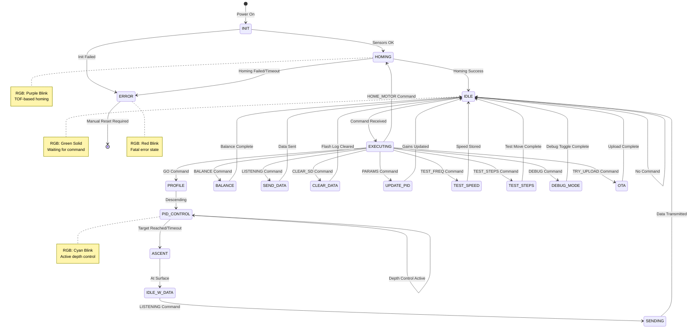
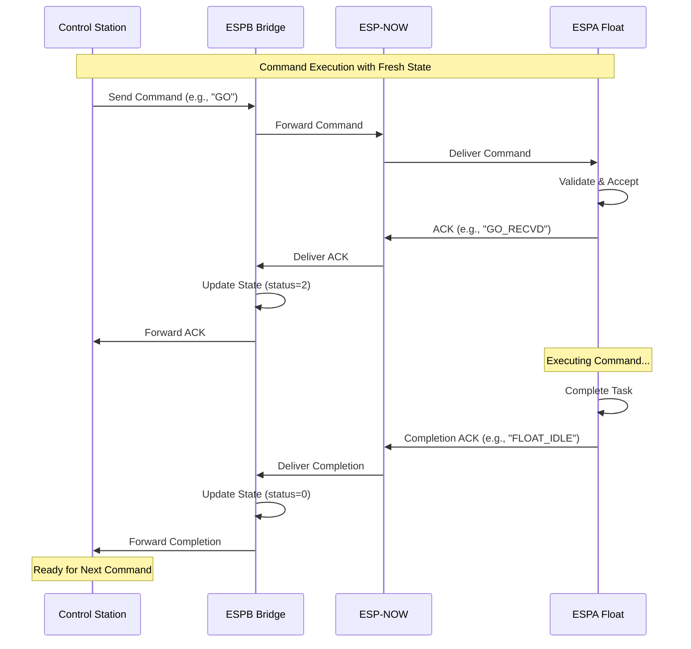
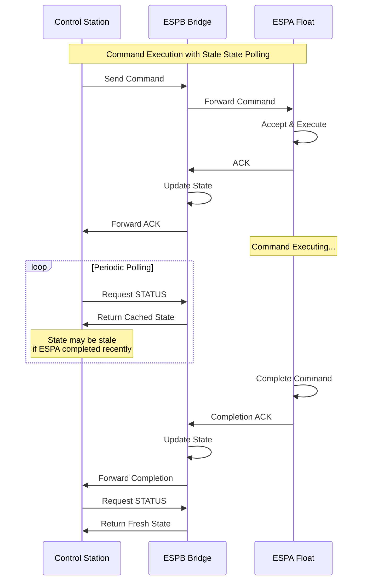

# PoliTOcean Float 2025 - Technical Documentation

**Version:** 11.1.0
**Team:** PoliTOcean @ Politecnico di Torino  
**Competition:** MATE ROV 2025/26

--------------------------------------------------------------------------

## TABLE OF CONTENTS

- [PoliTOcean Float 2025 - Technical Documentation](#politocean-float-2025---technical-documentation)
  - [TABLE OF CONTENTS](#table-of-contents)
  - [PROJECT OVERVIEW](#project-overview)
    - [Introduction and Requirements](#introduction-and-requirements)
    - [System Behavior](#system-behavior)
  - [HARDWARE CONFIGURATION](#hardware-configuration)
    - [Hardware Used](#hardware-used)
    - [Pin Mapping](#pin-mapping)
      - [ESPA (Float Controller) Pin Mapping:](#espa-float-controller-pin-mapping)
      - [ESPB (Communication Bridge) Pin Mapping:](#espb-communication-bridge-pin-mapping)
    - [I2C Device Addresses:](#i2c-device-addresses)
  - [SYSTEM ARCHITECTURE](#system-architecture)
    - [Deployment Diagram](#deployment-diagram)
    - [Software Structure](#software-structure)
    - [ESPA State Machine](#espa-state-machine)
  - [COMMUNICATION PROTOCOL](#communication-protocol)
    - [Command Lifecycle](#command-lifecycle)
    - [ESPB Bridge Role](#espb-bridge-role)
    - [FLOAT Commands](#float-commands)
    - [STATUS COMMAND: ESPB RESPONSE](#status-command-espb-response)
    - [GUI / ESPB / ESPA Protocol Contract](#gui--espb--espa-protocol-contract)
  - [LED STATUS INDICATORS](#led-status-indicators)
    - [ESPA (Float Board) LED States:](#espa-float-board-led-states)
    - [ESPB (Communication Bridge) LED States:](#espb-communication-bridge-led-states)
  - [DEVELOPMENT AND TESTING](#development-and-testing)
    - [PlatformIO Environments](#platformio-environments)
    - [Avvio da CLI](#avvio-da-cli)
    - [Test da CLI](#test-da-cli)
    - [Controllo manuale del solo motore](#controllo-manuale-del-solo-motore)
    - [Test Layout](#test-layout)
  - [UTILITIES AND RESOURCES](#utilities-and-resources)
  - [GLOSSARY](#glossary)

--------------------------------------------------------------------------

## PROJECT OVERVIEW

### Introduction and Requirements

By MATE 2026 requirements documentation (Task 4.1 - MATE Floats Under the Ice), the FLOAT must complete operational vertical profiling missions under simulated ice conditions.

**Pre-Deployment Requirements:**
- The FLOAT must communicate with the Mission Station (CS) prior to descending, transmitting a **defined data packet** containing:
  - Company number (provided by MATE)
  - Time data (UTC/local/float time)
  - Pressure data (pa or kpa) and/or depth data (m or cm)
  - Additional data as required
- Example packet: `EX01 1:51:42 UTC 9.8 kpa 1.00 meters`

**Vertical Profile Requirements:**

The FLOAT must complete **two vertical profiles** using a buoyancy engine (fluid displacement system, not thrusters). Each profile consists of:

1. **Descent Phase**: Descend from surface to **2.5 meters depth** (± 33 cm)
2. **Deep Hold**: Maintain depth at **2.5 meters** for **30 seconds** (bottom of float as reference)
3. **Ascent Phase**: Rise to **40 cm depth** (± 33 cm) without breaking surface or contacting ice
4. **Shallow Hold**: Maintain depth at **40 cm** for **30 seconds** (top of float as reference)

**Data Collection & Transmission:**

- Collect depth/pressure measurements during both profiles and transmit judge packets every **5 seconds** (minimum 20 data packets)
- Store data in ESP32 internal flash as a LittleFS CSV containing: company number, profile id, time, pressure, judge/reference depth, phase, and raw sensor depth
- After recovery, transmit all collected data wirelessly to the Mission Station
- Data packets must show **7 sequential measurements** (spanning 30 seconds at 5-second intervals: 0, 5, 10, 15, 20, 25, 30) confirming proper depth maintenance at both 2.5m and 0.4m

**Post-Mission Requirements:**

- Upon surface recovery, autonomously transmit all profile data to the CS
- CS GUI plots depth over time using received data (minimum 20 data packets required)
- Graph must display time (X-axis) vs depth (Y-axis) for both completed profiles

**Current firmware storage note:** the active implementation uses the internal flash CSV log (`FLASH_LOG_PATH`) as the primary mission data source. EEPROM compact records remain only as an internal legacy buffer. The legacy serial command name is still `CLEAR_SD`, but it now resets the flash CSV log and the legacy EEPROM buffer.

**Auto Mode (AM):**

An autonomous operating mode that triggers profile execution in case of connection loss with the CS, ensuring mission completion if communication is temporarily unavailable. AM will autonomously commit up to two profiles when connection is lost, preventing incomplete missions due to transient WiFi failures.

**Penalties:**
- Breaking surface or contacting ice sheet during profile: **-5 points per profile**
- FLOAT must remain submerged between 40 cm and 2.5 m throughout the ascent/descent phases

### System Behavior

The general idea is that the FLOAT provides some micro-services that the CS can activate by sending commands to it. Every command can be requested at any moment, with the only limit that a command can be accepted by the FLOAT only when the previous one has been completed (more info on command cycle later). 

The FLOAT has two main logical states: the command execution one, and the idle one in which it waits for the new command. In idle state, the FLOAT can have buffered flash data from the last completed profile that can be sent to the CS.

--------------------------------------------------------------------------

## HARDWARE CONFIGURATION

### Hardware Used

| Hardware | Role | Link | Key parameters / notes |
|:---------|:-----|:-----|:-----------------------|
| ESP32 Dev Module x2 | ESPA float controller and ESPB communication bridge | [Espressif ESP32](https://documentation.espressif.com/esp32-wroom-32e_esp32-wroom-32ue_datasheet_en.pdf) | Arduino framework, ESP-NOW link, USB serial bridge on ESPB |
| DRV8825 stepper driver | Stepper motor driver for syringe motion | [Pololu DRV8825 carrier](https://www.pololu.com/product/2133) | STEP/DIR control, active-low enable, SLEEP and RESET held HIGH during operation |
| Stepper motor with planetary gearbox | Syringe actuator motor | [StepperOnline 17HS15-1684S-PG27](https://www.omc-stepperonline.com/it/nema-17-motore-passo-passo-bipolare-l-38mm-w-rapporto-di-riduzione-27-1-riduttore-epicicloidale-17hs15-1684s-pg27) | NEMA 17, 200 steps/rev, 1.8 deg/step, configured gear ratio 26.85124:1, microstep setting 1 |
| Lead screw / threaded rod | Converts motor rotation to linear travel | [SIENOC 500 mm trapezoidal lead screw](https://www.amazon.it/SIENOC-500mm-Stampante-Trapezoidale-Piombo/dp/B078K7KN8W/) | Pitch 2.0 mm, 4 starts, lead 8.0 mm/rev, configured travel 45 mm |
| VL53L4CD Time-of-Flight sensor | Non-contact homing distance sensor | [ST VL53L4CD](https://www.st.com/en/imaging-and-photonics-solutions/vl53l4cd.html) | I2C 0x29, XSHUT GPIO16, GPIO1 GPIO15, 24 mm offset, 40 mm homing threshold |
| Bar02 pressure sensor | Pressure/depth measurement | [Blue Robotics Bar02](https://bluerobotics.com/store/sensors-cameras/sensors/bar02-sensor-r1/) | MS5837_02BA model, I2C 0x76, used for depth and pressure |
| INA219 battery monitor | Battery bus-voltage monitor | [Adafruit INA219 breakout](https://www.adafruit.com/product/904) | I2C 0x40, initialized at 100 kHz, configured with 5 A max and 0.1 ohm shunt |

### Pin Mapping

#### ESPA (Float Controller) Pin Mapping:

| Function | GPIO Pin | Connected To | Notes |
|:---------|:--------:|:------------|:------|
| **Motor Control** ||||
| DIR | GPIO32 | DRV8825 Direction | Stepper direction control |
| STEP | GPIO33 | DRV8825 Step | Step pulse generation |
| EN | GPIO27 | DRV8825 Enable | Active-LOW, disables outputs when HIGH |
| SLEEP | GPIO25 | DRV8825 Sleep | Active-LOW, must be HIGH for operation |
| RST | GPIO26 | DRV8825 Reset | Active-LOW, must be HIGH for operation |
| **TOF Sensor** ||||
| SDA | GPIO21 | VL53L4CD I2C Data | I2C bus (shared with sensors) |
| SCL | GPIO22 | VL53L4CD I2C Clock | I2C bus @ 1MHz |
| XSHUT | GPIO16 | VL53L4CD Shutdown | Sensor shutdown control |
| GPIO1 | GPIO15 | VL53L4CD Interrupt | Optional interrupt pin, unused in polling mode |
| **Sensors** ||||
| SDA | GPIO21 | Bar02, INA219 | I2C bus (shared) |
| SCL | GPIO22 | Bar02, INA219 | I2C bus (shared) |
| **Status LED** ||||
| LED_R | GPIO19 | Red Channel | PWM control |
| LED_G | GPIO18 | Green Channel | PWM control |
| LED_B | GPIO5 | Blue Channel | PWM control |

#### ESPB (Communication Bridge) Pin Mapping:

| Function | GPIO Pin | Connected To | Notes |
|:---------|:--------:|:------------|:------|
| **Communication** ||||
| TX | GPIO1 | USB Serial | 115200 baud |
| RX | GPIO3 | USB Serial | 115200 baud |
| **Status LED** ||||
| Built-in LED | GPIO2 | Onboard LED | Status indication |

### I2C Device Addresses:

| Device | Address | Bus Speed |
|:-------|:-------:|:---------|
| VL53L4CD TOF | 0x29 | 1 MHz |
| Bar02 Pressure | 0x76 | Shared I2C bus |
| INA219 Battery | 0x40 | Initialized at 100 kHz |

> The firmware initializes the INA219 at 100 kHz, then the VL53L4CD driver raises the shared `Wire` clock to 1 MHz for TOF ranging.

--------------------------------------------------------------------------

## SYSTEM ARCHITECTURE

### Deployment Diagram

FLOAT code has to be deployed on two ESP32, one mounted on the FLOAT board (ESPA) together with the sensors and the power supply, and the other (ESPB) communicating with the Control Station via USB. The two ESP32 communicates via WiFi using ESP-NOW protocol. The software on the two ESP32 is designed to work regardless of the design of the GUI on the CS. 

The idea is to bring all the complexity on the ESPA and GUI, leaving no trace of logic on the ESPB.


```mermaid
graph TB
    subgraph "Control Station"
        GUI[GUI Application]
        USB[USB Serial]
    end
    
    subgraph "ESPB - Communication Bridge"
        ESPB_FW[ESPB Firmware]
        ESPB_WiFi[WiFi ESP-NOW]
        ESPB_LED[Built-in LED]
    end
    
    subgraph "ESPA - Float Controller"
        ESPA_FW[ESPA Firmware]
        ESPA_WiFi[WiFi ESP-NOW]
        
        subgraph "Motor System"
            DRV8825[DRV8825 Driver]
            STEPPER[Stepper Motor]
            TOF[VL53L4CD TOF Sensor]
        end
        
        subgraph "Sensors"
            BAR02[Bar02 Pressure]
            INA219[INA219 Battery]
        end
        
        RGB[RGB LED]
        I2C[I2C Bus]
    end
    
    GUI -->|Commands| USB
    USB <-->|Serial 115200| ESPB_FW
    ESPB_FW <-->|ESP-NOW 2.4GHz| ESPB_WiFi
    ESPB_WiFi <-.->|WiFi| ESPA_WiFi
    ESPA_WiFi <-->|ESP-NOW| ESPA_FW
    
    ESPA_FW -->|Control Signals| DRV8825
    DRV8825 -->|STEP/DIR| STEPPER
    TOF -->|Distance Data| ESPA_FW
    
    BAR02 -->|I2C| I2C
    INA219 -->|I2C| I2C
    I2C -->|Sensor Data| ESPA_FW
    
    ESPA_FW -->|Status| RGB
    ESPB_FW -->|Status| ESPB_LED
    
    style ESPA_FW fill:#4CAF50
    style ESPB_FW fill:#2196F3
    style GUI fill:#FF9800
    style TOF fill:#9C27B0
```

### Software Structure

The project follows a modular architecture with separate compilation units:
- **Central Config** (`include/config.h`) - pin mapping, motor constants, PID defaults, mission timing, network parameters
- **Shared Protocol** (`include/float_common.h`) - ESP-NOW packet structs, ACK strings, EEPROM size, shared LED enum
- **Motor Control** (`lib/motor`) - DRV8825/FastAccelStepper setup, position tracking, bounded movement primitives
- **TOF Sensor** (`lib/tof`) - VL53L4CD initialization, corrected distance readings, and raw measurement metadata
- **Motion Control** (`lib/motion_control`) - TOF homing, safe max-extension move, balance routine, emergency stop handling
- **Communication** (`lib/comms`) - ESP-NOW wireless protocol and ElegantOTA session management
- **Sensors** (`lib/sensors`) - Bar02 pressure/depth and INA219 battery monitoring
- **PID Controller** (`lib/pid`) - depth control algorithm with runtime gain updates
- **Profile Manager** (`lib/profile`) - mission profile execution and flash-backed mission logging
- **Flash Storage** (`lib/flash_storage`) - LittleFS CSV mission log and replay helpers
- **LED Controller** (`lib/led`) - RGB status indication system

### ESPA State Machine

The ESPA firmware operates as a state machine coordinating motor control, sensors, and communications:


```mermaid
stateDiagram-v2
    [*] --> INIT: Power On
    
    INIT --> HOMING: Sensors OK
    INIT --> ERROR: Init Failed
    
    HOMING --> IDLE: Homing Success
    HOMING --> ERROR: Homing Failed/Timeout
    
    IDLE --> EXECUTING: Command Received
    IDLE --> IDLE: No Command
    
    EXECUTING --> PROFILE: GO Command
    EXECUTING --> BALANCE: BALANCE Command
    EXECUTING --> SEND_DATA: LISTENING Command
    EXECUTING --> CLEAR_DATA: CLEAR_SD Command
    EXECUTING --> UPDATE_PID: PARAMS Command
    EXECUTING --> TEST_SPEED: TEST_FREQ Command
    EXECUTING --> TEST_STEPS: TEST_STEPS Command
    EXECUTING --> DEBUG_MODE: DEBUG Command
    EXECUTING --> HOMING: HOME_MOTOR Command
    EXECUTING --> OTA: TRY_UPLOAD Command
    
    PROFILE --> PID_CONTROL: Descending
    PID_CONTROL --> PID_CONTROL: Depth Control Active
    PID_CONTROL --> ASCENT: Target Reached/Timeout
    ASCENT --> IDLE_W_DATA: At Surface
    
    BALANCE --> IDLE: Balance Complete
    SEND_DATA --> IDLE: Data Sent
    CLEAR_DATA --> IDLE: Flash Log Cleared
    UPDATE_PID --> IDLE: Gains Updated
    TEST_SPEED --> IDLE: Speed Stored
    TEST_STEPS --> IDLE: Test Move Complete
    DEBUG_MODE --> IDLE: Debug Toggle Complete
    OTA --> IDLE: Upload Complete
    
    IDLE_W_DATA --> SENDING: LISTENING Command
    SENDING --> IDLE: Data Transmitted
    
    ERROR --> [*]: Manual Reset Required
    
    note right of IDLE
        RGB: Green Solid
        Waiting for command
    end note
    
    note right of HOMING
        RGB: Purple Blink
        TOF-based homing
    end note
    
    note right of PID_CONTROL
        RGB: Cyan Blink
        Active depth control
    end note
    
    note right of ERROR
        RGB: Red Blink
        Fatal error state
    end note
```

--------------------------------------------------------------------------

## COMMUNICATION PROTOCOL

### Command Lifecycle

A command life-cycle does not overlaps/interfere with the previous nor the next one: when the CS sends a command (and it arrives to the FLOAT), a feedback from the FLOAT should inform about the acceptance of the command and if this acknowledgement arrives within a given period (specified later), next command requests will be ignored until end of execution of the current one, signaled by an idle acknowledgement. 

If the acknowledgement doesn't arrive within that time span, the command commit can be considered failed: this could happen for WiFi connection failures or FLOAT electronics issues. 

When waiting for the command commit acknowledgement, other command requests will be ignored as well.   

As already mentioned, after command completion the FLOAT will try to send an idle acknowledgement to signal that it is listening for a new command: together with the idle state, this acknowledgement can also inform about the presence of new flash-backed profile data that has to be sent to the CS. After an idle acknowledgement is received, a new command can be accepted.

To maintain consistency with the status stored on the ESPB, and hence with the GUI visuals, the FLOAT grants to send the acknowledgement signalling a command commit only when the commit can be given for sure. In the same way, if the acknowledgement fails to be sent due to connection issues, the command is not committed.


```mermaid
sequenceDiagram
    participant CS as Control Station
    participant ESPB as ESPB Bridge
    participant WiFi as ESP-NOW
    participant ESPA as ESPA Float
    
    Note over CS,ESPA: Command Execution with Fresh State
    
    CS->>ESPB: Send Command (e.g., "GO")
    ESPB->>WiFi: Forward Command
    WiFi->>ESPA: Deliver Command
    
    ESPA->>ESPA: Validate & Accept
    ESPA->>WiFi: ACK (e.g., "GO_RECVD")
    WiFi->>ESPB: Deliver ACK
    ESPB->>ESPB: Update State (status=2)
    ESPB->>CS: Forward ACK
    
    Note over ESPA: Executing Command...
    
    ESPA->>ESPA: Complete Task
    ESPA->>WiFi: Completion ACK (e.g., "FLOAT_IDLE")
    WiFi->>ESPB: Deliver Completion
    ESPB->>ESPB: Update State (status=0)
    ESPB->>CS: Forward Completion
    
    Note over CS: Ready for Next Command
```

### ESPB Bridge Role

The ESPB role is only to make the CS task of continuously checking on the WiFi channel less resource consuming. 

In particular, ESPB receives commands from CS via USB only to forward them to the FLOAT via WiFi. At the same time, it can receive feedback and data from the FLOAT. In the latter case the ESPB will forward the packages on the USB channel, while using them to update an internal state accordingly. The only code that should trigger the update of the state stored on ESPB is the firmware on the FLOAT, via the data and the feedback sent to CS (more later). This is because no assumptions have to be done by other software on the commands completion and acceptance. 

The ESPB state should mirror the FLOAT state at each moment (more details later) and can be used by the GUI to give visual feedback to the user or to drive its internal logic. It can be requested to the ESPB by the CS at any moment with a specific command. The state info sent to the CS with this command also contains WiFi connection state info and AM activation state info.  

In general, the ESPB feedback could be stale when requested (for example because the CS could poll it with a low frequency), so to get fresh, real-time data the CS should listen on the USB channel for the FLOAT packages, after a command request or when waiting for command completion and retrieve the FLOAT current state directly by those packages.  

Periodic polling remains a legit choice in case the CS cannot exploit interrupts triggered by Serial connection, but notice that this solution leads to delayed GUI visual feedback with respect to the changes on the FLOAT state.  

In some cases, connection losses can undermine consistency between the feedback of the ESPB (either they are polled or real time) and the real current FLOAT state (consistency threats for each FLOAT state later).


```mermaid
sequenceDiagram
    participant CS as Control Station
    participant ESPB as ESPB Bridge
    participant ESPA as ESPA Float
    
    Note over CS,ESPA: Command Execution with Stale State Polling
    
    CS->>ESPB: Send Command
    ESPB->>ESPA: Forward Command
    ESPA->>ESPA: Accept & Execute
    ESPA->>ESPB: ACK
    ESPB->>ESPB: Update State
    ESPB->>CS: Forward ACK
    
    Note over ESPA: Command Executing...
    
    loop Periodic Polling
        CS->>ESPB: Request STATUS
        ESPB->>CS: Return Cached State
        Note over CS: State may be stale<br/>if ESPA completed recently
    end
    
    ESPA->>ESPA: Complete Command
    ESPA->>ESPB: Completion ACK
    ESPB->>ESPB: Update State
    ESPB->>CS: Forward Completion
    
    CS->>ESPB: Request STATUS
    ESPB->>CS: Return Fresh State
```

### FLOAT Commands

Table of FLOAT commands with relative effects and acknowledgements:

|    Cmd string    | Cmd ESPA number | Cmd effects                                                                                                                                                     |       ESPA ack string       |      ESPA ack effects on ESPB state       |
| :--------------: | :-------------: | --------------------------------------------------------------------------------------------------------------------------------------------------------------- | :-------------------------: | :---------------------------------------: |
|        GO        |        1        | Performs the two MATE vertical profiles, sends the pre-descent data packet before the first descent, and logs pressure/depth records to flash CSV                 |          GO_RECVD           |    status to 2 (command execution)<br>    |
|    LISTENING     |        2        | Streams flash CSV records as JSON data packets at 5-second cadence, followed by `STOP_DATA`                                                                      |     Ack is data itself      |  status to 2 after first package arrival  |
|     BALANCE      |        3        | Extends the syringe to the safe maximum, holds for 5 s, then retracts to the safe margin                                                                          |         CMD3_RECVD          |                status to 2                |
|     CLEAR_SD     |        4        | Clears and recreates the flash CSV log, and clears the legacy EEPROM buffer. The command string is kept as `CLEAR_SD` for compatibility                          |         CMD4_RECVD          |                status to 2                |
| SWITCH_AUTO_MODE |        5        | Toggles FLOAT Auto Mode                                                                                                                                          |       SWITCH_AM_RECVD       | status to 2, AM activation state toggled  |
|   SEND_PACKAGE   |        6        | Sends a single live JSON snapshot containing company number, time, pressure, judge/reference depth, phase, and raw sensor depth                                  |  Ack is the package itself  |                status to 2                |
|    TRY_UPLOAD    |        7        | Starts the ElegantOTA access point on ESPA for a 5-minute upload window, then restores ESP-NOW                                                                    |       TRY_UPLOAD_RECVD      |                status to 2                |
| `PARAMS kp ki kd` |        8        | Updates PID gains at runtime                                                                                                                                    |      CHNG_PARMS_RECVD       |                status to 2                |
| `TEST_FREQ freq` |        9        | Sets manual test movement speed, clamped to 10-1200 steps/s                                                                                                      |       TEST_FREQ_RECVD       |                status to 2                |
| `TEST_STEPS n`   |       10        | Moves the motor by `n` relative steps at the current test speed                                                                                                  |      TEST_STEPS_RECVD       |                status to 2                |
|      DEBUG       |       11        | Toggles remote debug forwarding through `DebugSerial`                                                                                                            |      DEBUG_MODE_RECVD       |                status to 2                |
|    HOME_MOTOR    |       12        | Runs TOF-based homing remotely                                                                                                                                   |          HOME_RECVD         |                status to 2                |
|      STATUS      |        -        | Requests stale ESPB status plus AM state, WiFi connection state, battery millivolts, and last RSSI                                                               |              -              |                     -                     |

Once a command is completed, ESPA acknowledgement can be:

| ESPA ack string   | ESPA ack effects on ESPB state          | ESPA state                                  |
| ----------------- | --------------------------------------- | ------------------------------------------- |
| FLOAT_IDLE        | status to 0 (idle)                      | Idle with no data to be sent                |
| FLOAT_IDLE_W_DATA | status to 1 (idle with data to be sent) | Idle with data from last profile to be sent |

### STATUS COMMAND: ESPB RESPONSE

ESPB response to **STATUS** command is composed by five parts of information: ESPA state (stale), activation of the AM on the FLOAT, WiFi connection state, last received battery millivolts, and last received RSSI. The WiFi connection state is detected by sending a dummy command code `0`, while the other states are kept consistent with the ones on the FLOAT by updating them after acknowledgements reception.

**ESPA state:**

| ESPB state string | ESPB state number | State description                                                                                                     |
| :---------------: | :---------------: | --------------------------------------------------------------------------------------------------------------------- |
|      UNKNOWN      |        -1         | ESPB has not received any state message from ESPA since boot                                                          |
|     CONNECTED     |         0         | The FLOAT is listening for new command. Previous command succeeded                                                    |
| CONNECTED_W_DATA  |         1         | The FLOAT is listening for new command and has some new data from last profile to be sent. Previous command succeeded |
|   EXECUTING_CMD   |         2         | FLOAT is executing a command                                                                                          |
|   STATUS_ERROR    |         -         | Internal error in reading the state number                                                                            |

> **WARNING:**  
> If committing a profile automatically, the relative acknowledgement will likely fail due to connection loss. The profile is committed anyway as it is generated from connection loss in the first place, but the GUI may not have mean to detect it. So it will likely read an **inconsistent idle status** (CONNECTED or CONNECTED_W_DATA) until FLOAT is at water level with a stable WiFi connection. In the meantime the command commits will fail, for connection loss or because the FLOAT is underwater. Anyway WiFi connection state can be detected by the STATUS command, hence giving feedback on status consistency.
> 
> ```mermaid
> sequenceDiagram
>     participant CS as Control Station
>     participant ESPB as ESPB Bridge
>     participant ESPA as ESPA Float
>     
>     Note over ESPA: Auto Mode Active
>     Note over ESPA,ESPB: Connection Lost!
>     
>     ESPA->>ESPA: Detect Connection Loss
>     ESPA->>ESPA: Auto-commit Profile
>     
>     Note over ESPA: Descending...<br/>WiFi Unavailable
>     
>     ESPA-xESPB: ACK Fails (No Connection)
>     
>     Note over ESPB: State Becomes Inconsistent<br/>Still shows "IDLE"
>     
>     CS->>ESPB: Request STATUS
>     ESPB->>CS: CONNECTED | CONN_LOST
>     Note over CS: GUI shows inconsistent state<br/>but WiFi loss detected
>     
>     Note over ESPA: At Surface...<br/>WiFi Restored
>     
>     ESPA->>ESPB: FLOAT_IDLE_W_DATA
>     ESPB->>ESPB: Update to Consistent State
>     ESPB->>CS: Forward State
>     
>     Note over CS,ESPA: Consistency Restored
> ```

**AM state:**

| ESPB state string | State description                                                         |
| :---------------: | ------------------------------------------------------------------------- |
|   AUTO_MODE_YES   | AM on FLOAT is activated                                                  |
|   AUTO_MODE_NO    | AM on FLOAT is not activated: connection losses will not trigger profiles |

**WiFi connection state:**

| ESPB state string | State description                                            |
| :---------------: | ------------------------------------------------------------ |
|      CONN_OK      | WiFi connection is ok                                        |
|     CONN_LOST     | WiFi connection is currently down. ESPB state could be wrong |

**Battery and RSSI fields:**

| ESPB field | State description |
| :--------: | ------------------------------------------------------------ |
| `BATTERY: <mV>` | Last battery voltage received from ESPA acknowledgements |
| `RSSI: <dBm>` | Last ESP-NOW packet RSSI captured by ESPB promiscuous callback |

**Example of ESPB state response:** `CONNECTED_W_DATA | AUTO_MODE_NO | CONN_OK | BATTERY: 12450 | RSSI: -63`

At ESPB boot, before any ESPA packet is received, a status request may return:
`UNKNOWN | AUTO_MODE_NO | CONN_LOST | BATTERY: 0 | RSSI: 0`.

### GUI / ESPB / ESPA Protocol Contract

The GUI sends command strings to ESPB over USB serial. ESPB parses the string, sends the command number to ESPA over ESP-NOW, and forwards ESPA acknowledgements/data back to the GUI.

| GUI command | ESPA command number | ESPA acknowledgement / response |
| :---------- | :-----------------: | :------------------------------ |
| `GO` | 1 | `GO_RECVD` |
| `LISTENING` | 2 | Stored data packets, then `STOP_DATA` |
| `BALANCE` | 3 | `CMD3_RECVD` |
| `CLEAR_SD` | 4 | `CMD4_RECVD` |
| `SWITCH_AUTO_MODE` | 5 | `SWITCH_AM_RECVD` |
| `SEND_PACKAGE` | 6 | Live JSON packet |
| `TRY_UPLOAD` | 7 | `TRY_UPLOAD_RECVD` |
| `PARAMS kp ki kd` | 8 | `CHNG_PARMS_RECVD` |
| `TEST_FREQ freq` | 9 | `TEST_FREQ_RECVD` |
| `TEST_STEPS n` | 10 | `TEST_STEPS_RECVD` |
| `DEBUG` | 11 | `DEBUG_MODE_RECVD` |
| `HOME_MOTOR` | 12 | `HOME_RECVD` |
| `STATUS` | - | ESPB local status line with five ` | `-separated fields |

The peer MAC addresses are configured centrally in `include/config.h`: `MAC_ESPA` is used by ESPB, and `MAC_ESPB` is used by ESPA.

--------------------------------------------------------------------------

## LED STATUS INDICATORS

The FLOAT is equipped with RGB LEDs on both ESP32 boards that provide visual feedback about the system status:

### ESPA (Float Board) LED States:

| LED Color/Pattern | State | Description |
|:----------------:|:-----:|:------------|
| **Green Solid / Boot Blinks** | `LED_INIT` | System initializing |
| **Green Solid** | `LED_IDLE` | Ready and idle, waiting for commands |
| **Green Blink** | `LED_IDLE_WITH_DATA` | Idle with data ready to send |
| **Red Solid** | `LED_LOW_BATTERY` | Battery voltage below threshold (12.0V) |
| **Red Blink** | `LED_ERROR` | Error state or motor emergency stop |
| **Blue Solid** | `LED_PROFILE` | Running non-PID profile phase |
| **Yellow Blink** | `LED_AUTO_MODE` | Auto mode active |
| **Purple Blink** | `LED_HOMING` | Motor homing in progress |
| **Purple Solid** | `LED_MOTOR_MOVING` | Motor moving |
| **Cyan Blink** | `LED_PID_CONTROL` | PID depth control active |
| **White Solid** | `LED_COMMUNICATION` | Command received / communicating with ESPB |
| **Orange Blink** | `LED_OTA_MODE` | OTA update mode active |
| **Off** | `LED_OFF` | System off or disabled |

### ESPB (Communication Bridge) LED States:

| LED Pattern | State | Description |
|:----------------:|:-----:|:------------|
| **Solid On** | `LED_IDLE` | Connected and ready |
| **Very Fast Blink** | `LED_ERROR` | Communication error |
| **Off** | `LED_OFF` | System off or disabled |

> **Note**: ESPB uses the built-in LED (pin 2) with different blink patterns to indicate status, as it does not have external RGB connections.

--------------------------------------------------------------------------

## DEVELOPMENT AND TESTING

### PlatformIO Environments

| Environment | Purpose | Main Source |
|:------------|:--------|:------------|
| `espA` | Float controller firmware with sensors, TOF homing, motion control, PID, ESP-NOW, and OTA | `src/espA/main.cpp` |
| `espB` | USB-to-ESP-NOW bridge for the Control Station | `src/espB/main.cpp` |
| `espA_manual_keyboard` | Bench firmware for serial keyboard continuous motor movement without homing | `src/espA_manual_keyboard/main.cpp` |

Common commands:

```bash
pio run -e espA
pio run -e espB
pio run -e espA_manual_keyboard
pio test -e espA
```

### Avvio da CLI

Tutti i comandi vanno eseguiti dalla root del progetto:

```bash
cd Float_2025
```

Per compilare e caricare i firmware principali:

```bash
pio run -e espA -t upload
pio run -e espB -t upload
```

Per aprire il monitor seriale a 115200 baud:

```bash
pio device monitor -e espA
pio device monitor -e espB
```

### Test da CLI

Per lanciare tutti i test disponibili sull'ambiente `espA`:

```bash
pio test -e espA
```

Per lanciare un singolo test:

```bash
pio test -e espA -f unit_hw/motor/test_max_steps
pio test -e espA -f unit_hw/motor/test_speed
pio test -e espA -f integration/test_screw_lead_20mm
pio test -e espA -f integration/test_homing_only
pio test -e espA -f integration/test_tof_reading
pio test -e espA -f integration/test_homing_move_to_max
pio test -e espA -f integration/test_motor_direction
pio test -e espA -f integration/test_tof_motor_accuracy
```

Per testare ESPB senza ESPA accesa:

```bash
pio test -e espB -f unit_hw/espb_bridge/test_parser
pio test -e espB -f unit_hw/espb_bridge/test_status_format
pio test -e espB -f unit_hw/espb_bridge/test_protocol_contract
```

Per testare il bridge reale tra ESPB ed ESPA, caricare prima il firmware reale `espA`, attendere che ESPA sia in idle, poi lanciare:

```bash
pio test -e espB -f integration/test_espnow_bridge
```

Questo test usa solo il comando dummy `0` e `SWITCH_AUTO_MODE`; non avvia profili e non muove il motore.

Test disponibili:

| Test | Comando | Cosa verifica |
|:-----|:--------|:--------------|
| `test_max_steps` | `pio test -e espA -f unit_hw/motor/test_max_steps` | Muove solo il motore fino alla massima estensione sicura partendo da posizione logica 0 |
| `test_speed` | `pio test -e espA -f unit_hw/motor/test_speed` | Muove solo il motore in 6 movimenti alternati da 40 mm, aumentando velocita e accelerazione fino a 2300 |
| `test_screw_lead_20mm` | `pio test -e espA -f integration/test_screw_lead_20mm` | Esegue homing TOF, muove il motore di 20 mm e confronta il delta TOF interno |
| `test_motor_direction` | `pio test -e espA -f integration/test_motor_direction` | Muove solo il motore avanti/indietro e verifica la direzione logica; di default non usa il TOF |
| `test_tof_reading` | `pio test -e espA -f integration/test_tof_reading` | Inizializza solo il TOF e verifica letture valide per circa 30 s |
| `test_homing_only` | `pio test -e espA -f integration/test_homing_only` | Esegue solo l'homing con TOF |
| `test_homing_move_to_max` | `pio test -e espA -f integration/test_homing_move_to_max` | Esegue homing TOF e poi va alla massima estensione sicura |
| `test_tof_motor_accuracy` | `pio test -e espA -f integration/test_tof_motor_accuracy` | Confronta distanza TOF e posizione motore dopo l'homing |
| `test_parser` | `pio test -e espB -f unit_hw/espb_bridge/test_parser` | Verifica parsing comandi GUI/Serial verso pacchetti ESPA senza ESPA accesa |
| `test_status_format` | `pio test -e espB -f unit_hw/espb_bridge/test_status_format` | Verifica stato cached ESPB e formato `STATUS` a cinque campi |
| `test_protocol_contract` | `pio test -e espB -f unit_hw/espb_bridge/test_protocol_contract` | Blocca la coerenza comandi/ACK tra GUI, ESPB ed ESPA |
| `test_espnow_bridge` | `pio test -e espB -f integration/test_espnow_bridge` | Verifica ESP-NOW reale con ESPA firmware reale acceso, senza movimenti |

I test `test_max_steps`, `test_speed` e `test_motor_direction` sono quelli utili per muovere solo il motore senza fare homing TOF. Prima di lanciarli, assicurarsi che il pistone sia lontano dai fine corsa meccanici e che possa muoversi in entrambe le direzioni.

### Controllo manuale del solo motore

Per caricare il firmware da banco che permette di muovere il motore dalla tastiera seriale:

```bash
pio run -e espA_manual_keyboard -t upload
pio device monitor -e espA_manual_keyboard
```

Comandi nel monitor seriale:

| Tasto | Azione |
|:------|:-------|
| Freccia su oppure `w` | Tieni premuto per muovere verso home/up |
| Freccia giu oppure `s` | Tieni premuto per muovere verso extension/down |
| Spazio oppure `x` | Stop immediato e disabilita uscite motore |
| `p` | Stampa posizione corrente |
| `t` | Stampa una lettura TOF |
| `h` oppure `?` | Stampa help |

Questo firmware non esegue homing: all'avvio assegna una posizione logica centrale e muove mentre riceve ripetizioni del tasto premuto; quando rilasci il tasto si ferma automaticamente dopo un breve timeout. Durante il movimento stampa periodicamente posizione motore e distanza TOF. Usarlo solo con il meccanismo in una posizione fisicamente sicura.

### Test Layout

Hardware-oriented tests are stored under `test/`:
- `test/unit_hw/motor/test_max_steps` checks safe maximum extension from a known zero
- `test/unit_hw/motor/test_speed` checks alternating 40 mm moves while speed and acceleration increase up to 2300
- `test/integration/test_screw_lead_20mm` checks the configured screw pitch, starts, and lead with one 20 mm move measured internally by TOF
- `test/integration/test_tof_reading` checks that the TOF sensor initializes and returns valid distance samples for about 30 seconds
- `test/integration/test_homing_only` checks TOF-based homing
- `test/integration/test_homing_move_to_max` checks homing followed by safe full extension
- `test/integration/test_motor_direction` checks logical/physical motion direction, optionally using TOF
- `test/integration/test_tof_motor_accuracy` checks TOF and motor movement consistency

--------------------------------------------------------------------------

## UTILITIES AND RESOURCES

**Arduino Library Repositories:**
- BlueRobotics MS5837: https://github.com/bluerobotics/BlueRobotics_MS5837_Library
- FastAccelStepper: https://github.com/gin66/FastAccelStepper
- INA: https://github.com/Zanduino/INA
- VL53L4CD: https://github.com/stm32duino/VL53L4CD
- ESPAsyncWebServer: https://github.com/dvarrel/ESPAsyncWebSrv
- ElegantOTA: https://github.com/ayushsharma82/ElegantOTA

**Development Tools:**
- PlatformIO IDE: Modern embedded development platform
- ESP32 Arduino Core: Framework for ESP32 development
- FastAccelStepper Library: Timer/task-driven stepper motor control
- VL53L4CD Library: Time-of-Flight sensor driver

--------------------------------------------------------------------------

## GLOSSARY

- **AM (Auto Mode)**: Autonomous operation mode that triggers profiles on connection loss
- **CS (Control Station)**: Ground-based computer running the GUI application
- **ESPA**: ESP32 mounted on the Float board (primary controller)
- **ESPB**: ESP32 communication bridge between Float and CS
- **Flash Profile Log**: Current onboard LittleFS CSV storage used before JSON transmission
- **FastAccelStepper**: Timer/task-driven stepper library used by `MotorController`
- **MotionController**: Firmware layer that combines motor, TOF, LEDs, debug, timeouts, and emergency stops for safe movement routines
- **Commit a command**: To accept a sent command. After commit, command execution and success is ideally granted
- **Complete a command**: To execute all the requirements requested by a command
- **Profile**: A complete mission cycle (descent → depth control → ascent → data transmission)
- **TOF (Time-of-Flight)**: Non-contact distance measurement technology using light pulses
- **Homing**: Process of establishing the motor's zero reference position
- **PID Control**: Proportional-Integral-Derivative controller for precise depth maintenance
- **ESP-NOW**: Low-latency peer-to-peer WiFi communication protocol by Espressif

--------------------------------------------------------------------------

**Documentation Version:** 11.1.0
**Last Updated:** May 2026
**Team Contact:** PoliTOcean @ Politecnico di Torino
